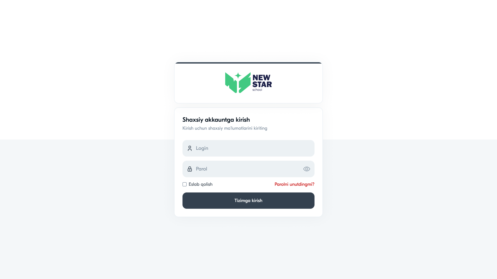

# 09 — Brending va logotip

## 1. Logotip

New Star School logotipi — "NS" monogrammasidan iborat bo'lib, kitob/qanot shaklini hosil qiladi va o'rtasida yulduz joylashgan. Bu **bilim** (kitob), **rivojlanish** (qanot) va **yorqin kelajak** (yulduz) ramzlarini birlashtiradi.

### Elementlar
- **Monogramma:** "NS" harflari, kitob/qanot shaklida
- **Yulduz:** markazda, brendning "Star" qismi
- **Matn:** "NEW STAR" (bold) + "school" (kichik, ostida)

### Rang variantlari
| Variant | Fon | Monogramma | Matn |
|---------|-----|-----------|------|
| **Asosiy (yashil fonda)** | `#41C981` | navy `#34414F` | oq |
| **Oq fonda** | oq/shaffof | navy + yashil yulduz | navy |
| **Inverted** | navy | yashil | oq |

> Login ekranida oq fonda navy monogramma + yashil yulduz + navy matn ishlatilgan.

---

## 2. Logotipdan foydalanish qoidalari

### Bo'sh joy (clear space)
Logotip atrofida kamida monogramma balandligining 1/2 qismicha bo'sh joy qoldiriladi.

### Minimal o'lcham
- Raqamli: balandligi `≥ 32px`
- "school" matni o'qilmaydigan darajada kichraytirilmaydi

### Taqiqlangan amallar
- ❌ Proporsiyani buzish (cho'zish/siqish)
- ❌ Ruxsatsiz ranglar
- ❌ Soya yoki effekt qo'shish
- ❌ Monogramma va matnni ajratib ishlatish (asosiy holatda)

---

## 3. Logotip joylashuvi tizimda

| Joy | Variant | Rasm |
|-----|---------|------|
| Sidebar (tepada) | yashil/oq monogramma + matn | `sidebar-oquvchi.png` |
| Login kartasi | oq fonda to'liq | `login.png` |
| Favicon/thumbnail | faqat monogramma | `thumbnail.png` |

---

## 4. Brend ranglari (xulosa)

| Rang | HEX | Ma'no |
|------|-----|-------|
| Yashil | `#41C981` | O'sish, yangilik, "New" |
| Navy | `#34414F` | Ishonch, jiddiylik, ta'lim |
| Oq | `#FFFFFF` | Toza, ochiq |

---

## 5. Brend ovozi (tone)

- **Til:** o'zbek tili, rasmiy-do'stona
- **Murojaat:** "siz" (hurmat)
- **Uslub:** sodda, tushunarli, ortiqcha atamasiz
- Interfeys matnlari qisqa va aniq ("Tizimga kirish", "Sinf yaratish")

---

⬅️ [08 — Animatsiyalar](08-Animatsiyalar.md) · ➡️ [10 — Navigatsiya](10-Navigatsiya.md)
