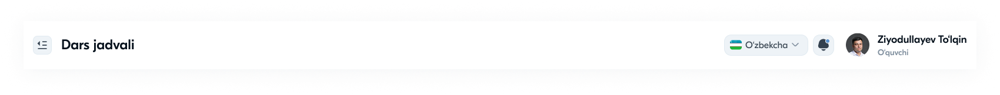

# 10 — Navigatsiya

Tizim navigatsiyasi ikki qismdan iborat: **yon panel (sidebar)** va **yuqori panel (topbar)**.

---

## 1. Yon panel (Sidebar)

To'q navy (`#34414F`) vertikal panel — asosiy navigatsiya markazi.


### Tuzilish (yuqoridan pastga)
1. **Logotip** — yashil/oq monogramma + "NEW STAR school"
2. **Ajratuvchi chiziq**
3. **Menyu elementlari** — rolga mos (har birida ikonka + matn)

### Menyu elementi (nav item) holatlari
| Holat | Ko'rinish |
|-------|-----------|
| Default | oq matn + chiziqli ikonka |
| **Active** | och plashka foni + bold + to'ldirilgan ikonka |
| Hover | yengil och fon |

### Spetsifikatsiya
```
kenglik: 300px
padding: 24px 16px
nav item balandligi: ~48px
ikonka–matn oraliq: 12px
ikonka o'lchami: 20–24px
```

### Rolga bog'liq menyu
Har bir rol o'z menyusini ko'radi (batafsil → [24-Foydalanuvchi-rollari.md](24-Foydalanuvchi-rollari.md)):

| Rol | Menyu elementlari |
|-----|-------------------|
| **Admin** | Asosiy sahifa · Dars jadvali · Sinflar ro'yhati · O'qituvchilar · O'quvchilar · Fanlar · Shaxsiy ma'lumotlar |
| **Direktor** | Asosiy sahifa · Reyting · O'qituvchilar · O'quvchilar · Xodimlar · Shaxsiy ma'lumotlar |
| **Zavuch** | Asosiy sahifa · Dars jadvali · Sinflar ro'yhati · O'qituvchilar · O'quvchilar · Shaxsiy ma'lumotlar |
| **O'qituvchi** | Asosiy sahifa · Sinflar · Shaxsiy ma'lumotlar |
| **O'quvchi** | Asosiy sahifa · Dars jadvali · Baxolar reytingi · Davomat · Shaxsiy ma'lumotlar |

### Yig'iladigan holat (collapsed)
- `⇤` tugma bilan sidebar `72px` ga yig'iladi
- Faqat ikonkalar qoladi, matn yashiriladi
- Hoverda tooltip ko'rsatish tavsiya etiladi

---

## 2. Yuqori panel (Topbar)

Oq fonli gorizontal panel — kontekst va foydalanuvchi boshqaruvi.



### Tuzilish
**Chap tomon:**
- `⇤` Sidebar yig'ish tugmasi
- Sahifa nomi (masalan, "Dars jadvali")

**O'ng tomon:**
- 🏳 Til tanlash ("O'zbekcha ▾" + bayroq)
- 🔔 Bildirishnoma (badge bilan)
- 👤 Foydalanuvchi: avatar + ism + rol

### Spetsifikatsiya
```
balandlik: 80px
fon: #FFFFFF + shadow-sm
padding: 0 24px
sahifa nomi: 24px / 700
user chip: avatar 36px + ism (14/600) + rol (13/regular kulrang)
```

### Til tanlash (Language switcher)
- Standart: **O'zbekcha** (O'zbekiston bayrog'i)
- Bosilganda dropdown — boshqa tillar (kelajakda: Ruscha, English)

### Bildirishnoma (Notification)
- 🔔 ikonka + qizil badge (o'qilmagan xabarlar soni)
- Bosilganda — bildirishnomalar paneli (kelajak funksiya)

---

## 3. Navigatsiya ierarxiyasi

```
Login
  └─ Asosiy sahifa (rolga mos kartochkalar)
       ├─ Modul ro'yxati (jadval/grid)
       │     └─ Batafsil (detal sahifa)  ──┐
       │                                     ├─ breadcrumb orqali ortga
       │     └─ Modal (yaratish/tahrirlash)  │
       └─ Shaxsiy ma'lumotlar
             └─ Tizimdan chiqish → Login
```

### Breadcrumb (detal sahifalarda)
```
O'qituvchilar  ›  Tohir Usenov Kamoliddin o'g'li
```
Detal sahifalarda yuqorida ko'rinadi; birinchi element ro'yxatga qaytaradi.

---

## 4. Navigatsiya qoidalari

1. **Faol holat** har doim aniq ko'rsatiladi (sidebarda plashka).
2. **Asosiy sahifa** — markaziy markaz; har modulga undan kirish mumkin.
3. Modul kartochkalari sidebar menyusini takrorlaydi (qulaylik uchun ikki yo'l).
4. **Tizimdan chiqish** faqat Shaxsiy ma'lumotlar sahifasida (xavfsizlik).
5. Breadcrumb chuqur sahifalarda yo'nalishni saqlaydi.

---

⬅️ [09 — Brending](09-Brending-logotip.md) · ➡️ [11 — Ikonkalar](11-Ikonkalar.md)
