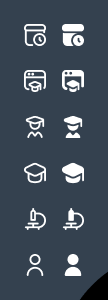
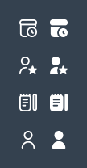

# 11 — Ikonkalar (Iconography)

Tizim yagona, izchil ikonka to'plamidan foydalanadi. Ikonkalar ikki holatda mavjud: **chiziqli (outline)** — nofaol, va **to'ldirilgan (filled)** — faol.



---

## 1. Uslub

- **Turi:** chiziqli + to'ldirilgan juftliklar
- **Chiziq qalinligi:** ~2px (outline)
- **Burchaklar:** yumshoq (rounded)
- **O'lcham:** 20–24px (interfeysda), grid 24×24
- **Rang:** sidebarda oq; faolda yorqinroq/to'ldirilgan

---

## 2. Navigatsiya ikonkalari

| Modul | Tavsif | Outline / Filled |
|-------|--------|------------------|
| Asosiy sahifa | uy (home) | ✓ / ✓ |
| Dars jadvali | kalendar/jadval (soat bilan) | ✓ / ✓ |
| Sinflar | monitor/doska | ✓ / ✓ |
| O'qituvchilar | bosh + akademik kalpoq (ustoz) | ✓ / ✓ |
| O'quvchilar | bitiruvchi kalpoq (graduation) | ✓ / ✓ |
| Fanlar | mikroskop | ✓ / ✓ |
| Xodimlar | bedj/ID karta | ✓ / ✓ |
| Davomat | bloknot/ro'yxat | ✓ / ✓ |
| Baholar reytingi | bosh + yulduz | ✓ / ✓ |
| Shaxsiy ma'lumotlar | odam (person) | ✓ / ✓ |



---

## 3. Amaliy (action) ikonkalar

| Ikonka | Vazifa | Rang |
|--------|--------|------|
| ✏ (qalam) | Tahrirlash | ko'k `#125DAC` |
| 🗑 (savat) | O'chirish | qizil `#C70909` |
| 🔍 (lupa) | Qidiruv | kulrang |
| ▾ (chevron) | Dropdown | kulrang |
| › (strelka) | Batafsil / oldinga | ko'k |
| ‹ › | Sahifalash | navy/ko'k |
| ☰ / ⇤ | Sidebar yig'ish | navy |
| 🔔 (qo'ng'iroq) | Bildirishnoma | navy |
| 👁 (ko'z) | Parol ko'rsatish | kulrang |
| 👤 (odam) | Login maydoni | kulrang |
| 🔒 (qulf) | Parol maydoni | kulrang |
| ✕ | Modal yopish | kulrang |
| 👥 (odamlar) | O'quvchilar soni | kulrang |

---

## 4. Holat (state) ko'rsatkichi

Sidebar menyusida ikonka faol holatni bildiradi:
- **Nofaol:** chiziqli (outline) ikonka, oq matn
- **Faol:** to'ldirilgan (filled) ikonka + bold matn + plashka foni


---

## 5. Texnik tavsiya (implementatsiya)

Ikonkalar uchun **SVG** formatidan foydalanish tavsiya etiladi:

- **Kutubxona:** `lucide-react` yoki `react-icons` (Feather/Tabler to'plami uslubga mos)
- Mos ikonkalar: `Home`, `Calendar`, `Users`, `GraduationCap`, `Microscope`, `User`, `ClipboardList`, `Star`, `IdCard`, `Edit`, `Trash2`, `Search`, `ChevronDown`, `ChevronRight`, `Bell`, `Eye`, `Lock`, `X`, `Menu`

```jsx
// Misol: navigatsiya ikonkasi (filled holatda fill berib)
import { Calendar } from 'lucide-react';

<Calendar size={22} strokeWidth={2} className={active ? 'icon-active' : 'icon'} />
```

```css
.icon        { color: #FFFFFF; opacity: .85; }
.icon-active { color: #FFFFFF; opacity: 1; }   /* faol — to'liq, fill bilan */
```

### Qoidalar
1. Bir interfeysda bir to'plamni aralashtirmaslik (faqat bitta icon set).
2. Ikonka har doim matn bilan birga (yolg'iz ikonkaga `aria-label`).
3. Dekorativ ikonkalarga `aria-hidden="true"`.

---

⬅️ [10 — Navigatsiya](10-Navigatsiya.md) · ➡️ [12 — Sahifa: Login](12-Sahifa-Login.md)
