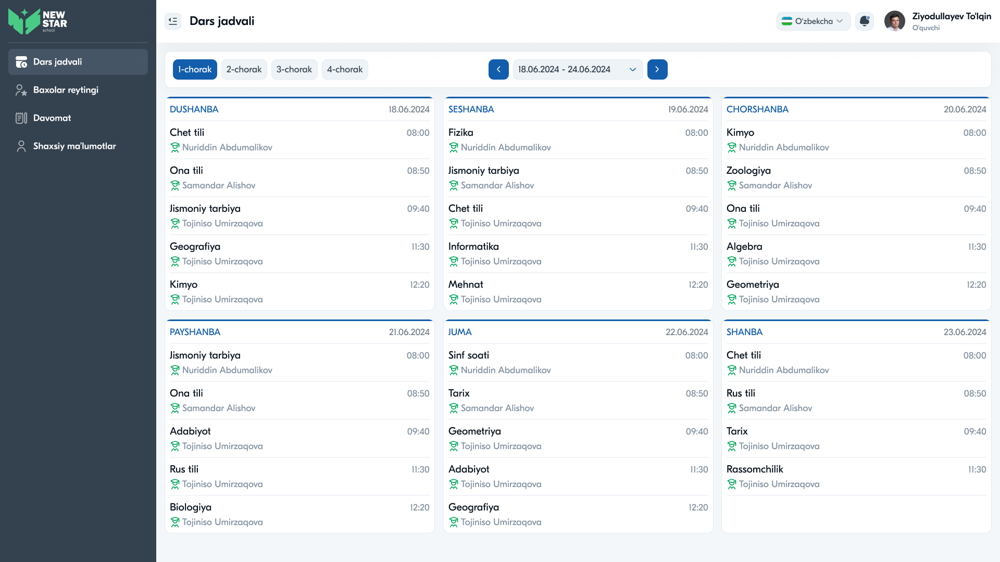
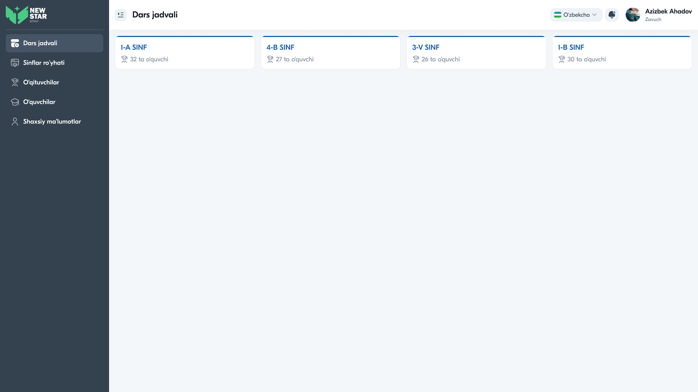

# 14 — Sahifa tahlili: Dars jadvali



## Maqsad
Haftalik dars jadvalini ko'rsatish: kunlar bo'yicha fanlar, vaqt va o'qituvchi. O'quvchi o'z jadvalini ko'radi; Admin/Zavuch sinflar jadvalini boshqaradi.

## Kim ko'radi
O'quvchi (o'z jadvali), Zavuch, Admin (sinf tanlash orqali).

---

## Layout tahlili — O'quvchi ko'rinishi

```
Dars jadvali
[1-chorak][2-chorak][3-chorak][4-chorak]   ‹ 18.06–24.06.2024 ›
┌─ DUSHANBA  18.06 ─┐ ┌─ SESHANBA 19.06 ─┐ ┌─ CHORSHANBA ─┐
│ Chet tili    08:00│ │ Fizika     08:00 │ │ Kimyo  08:00 │
│ 👨‍🏫 N. Abdumalikov│ │ ...              │ │ ...          │
│ Ona tili     08:50│ │                  │ │              │
└──────────────────┘ └──────────────────┘ └──────────────┘
┌─ PAYSHANBA ──────┐ ┌─ JUMA ───────────┐ ┌─ SHANBA ─────┐
│ ...              │ │ ...              │ │ ...          │
└──────────────────┘ └──────────────────┘ └──────────────┘
```

- **Filtr tablar:** 1–4 choraklar (faol — ko'k)
- **Sana navigatsiyasi:** `‹ hafta oralig'i ›` (ko'k strelkalar)
- **Haftalik grid:** 6 kun kartochkasi (3×2)
- Har kun: sarlavha (kun + sana) + darslar ro'yxati

### Dars qatori
```
Fan nomi                          Vaqt
👨‍🏫 O'qituvchi ismi
```

---

## Layout tahlili — Admin/Zavuch ko'rinishi

Admin/Zavuch avval **sinf tanlaydi**, keyin jadvalni ko'radi/tahrirlaydi:



```
Dars jadvali
┌─ 1-A SINF ──┐ ┌─ 4-B SINF ──┐ ┌─ 3-V SINF ──┐ ┌─ 1-B SINF ──┐
│ 👥 32 o'quvchi│ │ 👥 27       │ │ 👥 26       │ │ 👥 30       │
└─────────────┘ └─────────────┘ └─────────────┘ └─────────────┘
```

---

## Komponentlar

| Komponent | Tafsilot |
|-----------|----------|
| Chorak tablar | 1–4, faol ko'k |
| Hafta navigatori | sana oralig'i + ‹ › |
| Kun kartochkasi | sarlavha (kun/sana) + darslar |
| Dars qatori | fan + vaqt + o'qituvchi (ikonka bilan) |
| Sinf kartochkasi (admin) | nom + o'quvchilar soni |

---

## Interaksiyalar

1. **Chorak tanlash** — jadval o'sha chorakka almashadi
2. **Hafta strelkalari** — oldingi/keyingi haftaga o'tish
3. **Sinf tanlash (admin)** — sinf jadvaliga kirish
4. **Dars qatori (admin)** — tahrirlash/qo'shish (modal orqali)

---

## UX qaydlar

- ✅ Haftalik ko'rinish — bir qarashda butun hafta ko'rinadi
- ✅ Chorak + hafta filtrlari — moslashuvchan navigatsiya
- ✅ O'qituvchi ismi har darsda — qulay
- ⚠️ **Tavsiya:** joriy kun/dars vizual ajratilsin (highlight)
- ⚠️ **Tavsiya:** xona/kabinet raqami qo'shish
- ⚠️ **Tavsiya:** mobilda kun bo'yicha akkordeon yoki tab
- ⚠️ **Tavsiya:** bo'sh kun uchun "Dars yo'q" holati

---

## Accessibility qaydlar

- Jadval semantik tuzilishda (`<table>` yoki `role="grid"` yoki ARIA bilan kartochkalar)
- Sana navigatsiyasi tugmalari `aria-label="Oldingi hafta"` / "Keyingi hafta"
- Choraklar `role="tablist"` / `role="tab"` + `aria-selected`
- Vaqt formati izchil (HH:MM)

---

⬅️ [13 — Asosiy sahifa](13-Sahifa-Asosiy.md) · ➡️ [15 — Sinflar](15-Sahifa-Sinflar.md)
