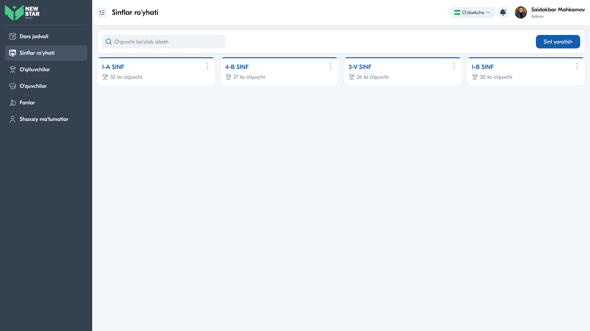
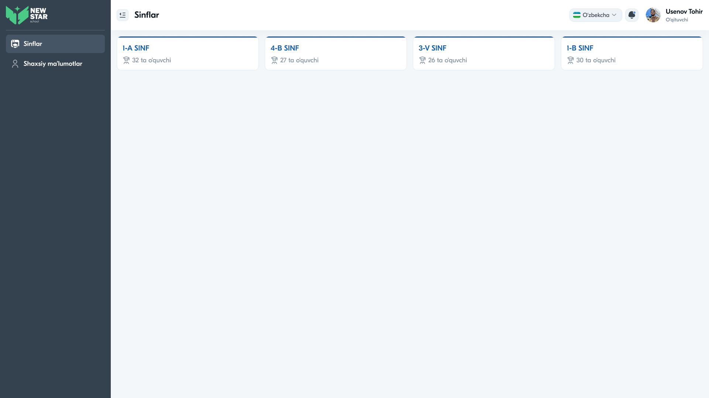

# 15 — Sahifa tahlili: Sinflar ro'yhati



## Maqsad
Maktabdagi barcha sinf va guruhlarni boshqarish: ko'rish, qidirish, yaratish, tahrirlash, o'chirish. Har sinfda o'quvchilar soni ko'rsatiladi.

## Kim ko'radi
Admin, Zavuch (to'liq boshqaruv), O'qituvchi (faqat o'z sinflari — "Sinflar").

---

## Layout tahlili — Admin ko'rinishi

```
Sinflar ro'yhati
[🔍 O'quvchi bo'ylab izlash      ]          [+ Sinf yaratish]
┌─ 1-A SINF      ⋮ ┐ ┌─ 4-B SINF   ⋮ ┐ ┌─ 3-V SINF  ⋮ ┐ ┌─ 1-B SINF ⋮ ┐
│ 👥 32 ta o'quvchi │ │ 👥 27        │ │ 👥 26        │ │ 👥 30      │
└──────────────────┘ └──────────────┘ └──────────────┘ └────────────┘
```

- **Qidiruv:** o'quvchi bo'yicha
- **"Sinf yaratish"** tugmasi (ko'k, o'ng tepada)
- **Sinf kartochkalari:** nom (ko'k) + son + `⋮` menyu

---

## Layout tahlili — O'qituvchi ko'rinishi

O'qituvchi faqat o'ziga biriktirilgan sinflarni ko'radi (qidiruv/yaratishsiz):



---

## Komponentlar

| Komponent | Tafsilot |
|-----------|----------|
| Search field | "O'quvchi bo'ylab izlash" |
| "Sinf yaratish" tugma | ko'k, modal ochadi |
| Class card | tepada ko'k chiziq + nom + 👥 son + `⋮` |
| Context menu (`⋮`) | Tahrirlash / O'chirish |

---

## Interaksiyalar

1. **Sinf kartochkasi bosish** — sinf detali (o'quvchilar ro'yxati / jadval)
2. **"Sinf yaratish"** — modal: sinf raqami (`9 sinf`) + guruh (`A guruh`) → Saqlash
3. **`⋮` menyu** — Tahrirlash / O'chirish
4. **Qidiruv** — o'quvchi ismi bo'yicha filtrlash


---

## UX qaydlar

- ✅ O'quvchilar soni darhol ko'rinadi — foydali
- ✅ Yaratish modali sodda (2 dropdown)
- ✅ Rolga moslik: o'qituvchi faqat o'z sinflari
- ⚠️ **Tavsiya:** sinf rahbari (klass rahbar) ismini kartochkada ko'rsatish
- ⚠️ **Tavsiya:** o'chirishdan oldin tasdiqlash modali ("Rostdan o'chirilsinmi?")
- ⚠️ **Tavsiya:** bo'sh holat ("Hali sinf yo'q. Yangi sinf yarating")

---

## Accessibility qaydlar

- Kartochka — klaviatura bilan ochiladigan (`tabindex`, `Enter`)
- `⋮` tugma `aria-label="Amallar"` + menyu `role="menu"`
- Qidiruv inputiga `aria-label`
- O'chirish tasdig'i fokusni modalga ko'chiradi

---

⬅️ [14 — Dars jadvali](14-Sahifa-Dars-jadvali.md) · ➡️ [16 — O'qituvchilar](16-Sahifa-Oqituvchilar.md)
