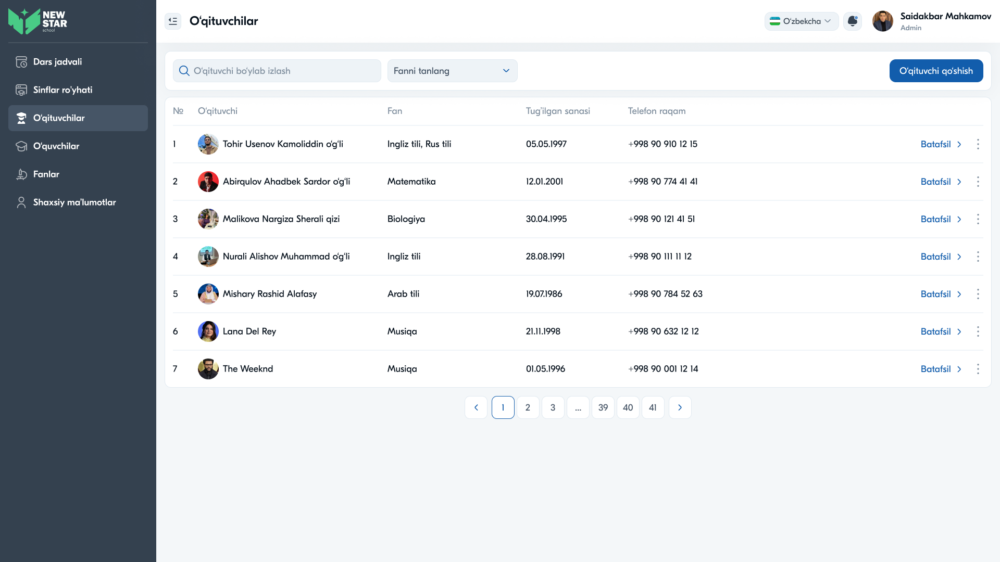
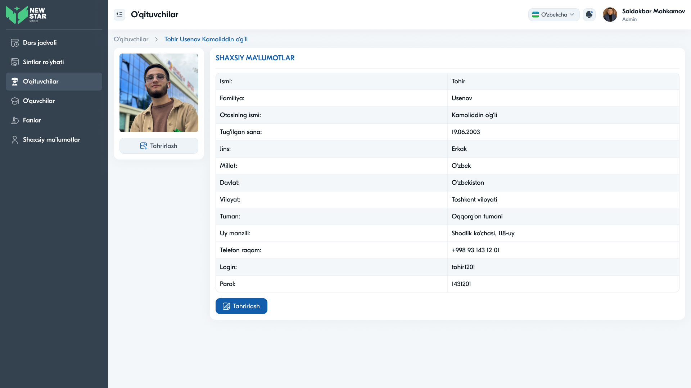

# 16 — Sahifa tahlili: O'qituvchilar



## Maqsad
O'qituvchilar ma'lumotlar bazasini boshqarish: ro'yxat, qidiruv, fan bo'yicha filtr, qo'shish va batafsil profil ko'rish.

## Kim ko'radi
Admin, Direktor, Zavuch. Admin/Zavuch — to'liq boshqaruv; Direktor — asosan ko'rish.

---

## Layout tahlili — Ro'yxat

```
O'qituvchilar
[🔍 O'qituvchi bo'ylab izlash ]  [Fanni tanlang ▾]   [+ O'qituvchi qo'shish]
┌─────────────────────────────────────────────────────────────────┐
│ №  O'qituvchi        Fan        Tug'ilgan    Telefon            ⋮ │
├─────────────────────────────────────────────────────────────────┤
│ 1  [👤] Tohir Usenov  Ingliz/Rus 05.05.1997  +998 90 910 12 15  Batafsil ⋮│
│ 2  [👤] Abirqulov...   Matematika 12.01.2001  ...               Batafsil ⋮│
└─────────────────────────────────────────────────────────────────┘
                          ‹ 1 2 3 … 39 40 41 ›
```

### Jadval ustunlari
| Ustun | Tavsif |
|-------|--------|
| № | Tartib raqami |
| O'qituvchi | Avatar + F.I.Sh |
| Fan | O'qitadigan fan(lar) |
| Tug'ilgan sanasi | Sana |
| Telefon raqam | +998 ... |
| Batafsil | Profilga havola |
| `⋮` | Tahrirlash / O'chirish |

---

## Layout tahlili — Batafsil (profil)



```
O'qituvchilar › Tohir Usenov Kamoliddin o'g'li
┌──────────┐  SHAXSIY MA'LUMOTLAR
│  [rasm]  │  Ismi:           Tohir
│          │  Familiya:       Usenov
│ [Tahrir] │  Otasining ismi: Kamoliddin o'g'li
└──────────┘  Tug'ilgan sana: 19.06.2003
              Jins:           Erkak
              Millat:         O'zbek
              Davlat:         O'zbekiston
              Viloyat:        Toshkent viloyati
              Tuman:          Oqqorg'on tumani
              Uy manzili:     Shodlik ko'chasi, 118-uy
              Telefon raqam:  +998 93 143 12 01
              Login:          tohir1201
              Parol:          1431201
              [Tahrirlash]
```

> Direktor profilni ko'radi, lekin "Tahrirlash" tugmasi bo'lmasligi mumkin (faqat ko'rish).

---

## Komponentlar
Search · Dropdown (fan) · "O'qituvchi qo'shish" tugma · Table (avatar, "Batafsil", `⋮`) · Pagination · Breadcrumb · Profil karta (rasm + detal jadval).

---

## Interaksiyalar

1. **Qidiruv** — ism bo'yicha
2. **Fan filtri** — fan bo'yicha ro'yxatni toraytirish
3. **"O'qituvchi qo'shish"** — yangi o'qituvchi formasi (modal yoki sahifa)
4. **"Batafsil"** — to'liq profil
5. **`⋮`** — Tahrirlash / O'chirish
6. **Sahifalash** — 41 sahifa (ko'p ma'lumot)

---

## UX qaydlar

- ✅ Filtr + qidiruv — katta ro'yxatda topish oson
- ✅ Avatar — vizual tanib olish
- ✅ Batafsil profil to'liq ma'lumot beradi
- 🔴 **Xavfsizlik muammosi:** profilda **parol ochiq matnda** ko'rinadi (`1431201`). Bu jiddiy xavf. Tavsiya: parolni ko'rsatmaslik yoki faqat "qayta tiklash" funksiyasi berish; parollar bazada **hash** holatida saqlanishi shart (→ [36-Backend-security-jwt.md](36-Backend-security-jwt.md))
- ⚠️ **Tavsiya:** ustunlar bo'yicha saralash (ism, sana)
- ⚠️ **Tavsiya:** Direktor uchun "faqat ko'rish" holati aniq belgilansin

---

## Accessibility qaydlar

- Jadval `<table>` semantikasida (`<th scope="col">`)
- "Batafsil" havolasiga kontekst: `aria-label="Tohir Usenov profili"`
- Filtr/qidiruv label bilan
- Pagination `nav[aria-label="Sahifalar"]`, faol sahifa `aria-current="page"`

---

⬅️ [15 — Sinflar](15-Sahifa-Sinflar.md) · ➡️ [17 — O'quvchilar](17-Sahifa-Oquvchilar.md)
