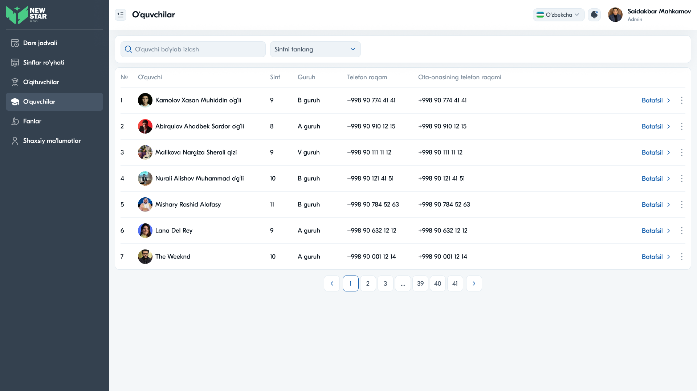

# 17 — Sahifa tahlili: O'quvchilar



## Maqsad
O'quvchilar ma'lumotlar bazasini boshqarish: ro'yxat, qidiruv, sinf bo'yicha filtr, batafsil profil. Har o'quvchi uchun sinf, guruh, telefon va ota-ona telefoni ko'rsatiladi.

## Kim ko'radi
Admin, Direktor, Zavuch.

---

## Layout tahlili — Ro'yxat

```
O'quvchilar
[🔍 O'quvchi bo'ylab izlash ]  [Sinfni tanlang ▾]
┌──────────────────────────────────────────────────────────────────────┐
│ №  O'quvchi         Sinf  Guruh  Telefon raqam   Ota-onasining tel.  ⋮ │
├──────────────────────────────────────────────────────────────────────┤
│ 1  [👤] Kamolov X.   9     B guruh +998 90 774... +998 90 774...  Batafsil ⋮│
│ 2  [👤] Abirqulov... 8     A guruh ...            ...             Batafsil ⋮│
└──────────────────────────────────────────────────────────────────────┘
                          ‹ 1 2 3 … 39 40 41 ›
```

### Jadval ustunlari
| Ustun | Tavsif |
|-------|--------|
| № | Tartib raqami |
| O'quvchi | Avatar + F.I.Sh |
| Sinf | Sinf raqami (9, 8, 10...) |
| Guruh | A / B / V guruh |
| Telefon raqam | O'quvchi telefoni |
| Ota-onasining telefon raqami | Ota-ona telefoni |
| Batafsil | Profilga havola |
| `⋮` | Tahrirlash / O'chirish |

---

## Layout tahlili — Batafsil (profil)

O'quvchi profili to'liq ma'lumotni o'z ichiga oladi (Shaxsiy ma'lumotlar bilan bir xil struktura):

Ismi · Familiya · Otasining ismi · Tug'ilgan sana · Jins · Millat · Davlat · Viloyat · Tuman · Uy manzili · **Sinf** · Telefon raqam · Login · Parol.

> Detal sahifa "Batafsil" bosilganda breadcrumb bilan ochiladi (O'qituvchilar moduliga o'xshash struktura).

---

## Komponentlar
Search · Dropdown (sinf) · Table (avatar, ikki telefon ustuni, "Batafsil", `⋮`) · Pagination · Profil karta.

---

## Interaksiyalar

1. **Qidiruv** — ism bo'yicha
2. **Sinf filtri** — sinf bo'yicha toraytirish
3. **"Batafsil"** — to'liq profil
4. **`⋮`** — Tahrirlash / O'chirish
5. **O'quvchi qo'shish** — (Admin/Zavuch) yangi o'quvchi formasi

---

## UX qaydlar

- ✅ Ota-ona telefoni alohida ustun — maktab uchun muhim
- ✅ Sinf + guruh tez ko'rinadi
- ✅ Rolga moslik: Zavuch ko'rinishida qo'shish/menyu cheklangan
- 🔴 **Xavfsizlik:** profilda parol ochiq — yashirish/hash zarur (16-modul bilan bir xil tavsiya)
- ⚠️ **Tavsiya:** sinf+guruhni bitta ustunga birlashtirish ("9-B") — joy tejaydi
- ⚠️ **Tavsiya:** ota-ona ismini ham qo'shish (faqat telefon emas)
- ⚠️ **Tavsiya:** o'quvchi statusini ko'rsatish (faol / ta'tilda / chiqarilgan)

---

## Accessibility qaydlar

- Telefon raqamlari `tel:` havola sifatida (qulay qo'ng'iroq)
- Jadval `<th scope>` bilan; ikki telefon ustuni aniq nomlangan
- Filtr/qidiruv label bilan
- Raqamlar `tabular-nums` bilan tekislangan

---

⬅️ [16 — O'qituvchilar](16-Sahifa-Oqituvchilar.md) · ➡️ [18 — Fanlar](18-Sahifa-Fanlar.md)
