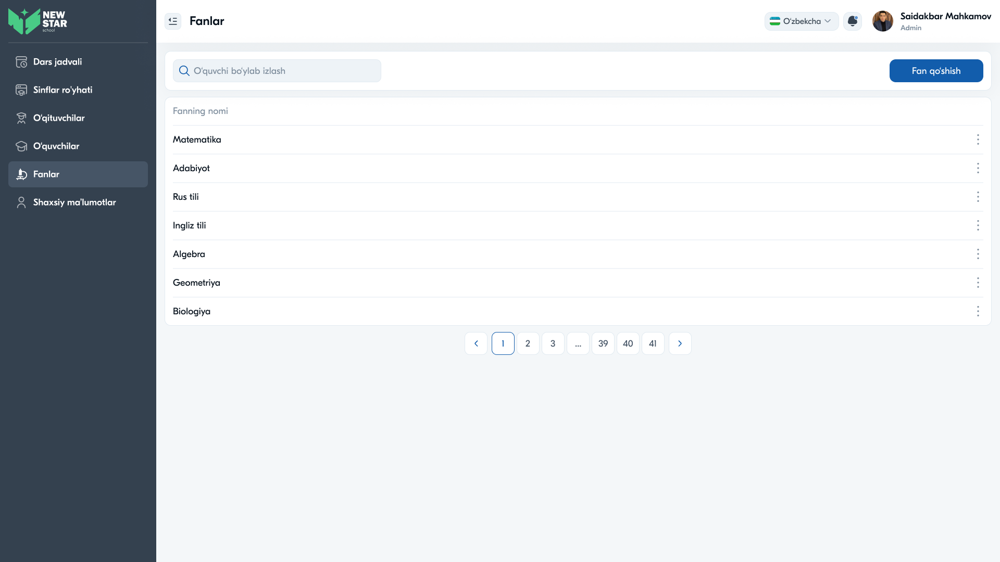

# 18 — Sahifa tahlili: Fanlar



## Maqsad
Maktabda o'qitiladigan fanlar ro'yxatini boshqarish: ko'rish, qidirish, qo'shish, tahrirlash, o'chirish.

## Kim ko'radi
Admin (Zavuch menyusida Fanlar yo'q; bu Admin moduli).

---

## Layout tahlili

```
Fanlar
[🔍 izlash                              ]          [+ Fan qo'shish]
┌─────────────────────────────────────────────────────────────┐
│ Fanning nomi                                               ⋮ │
├─────────────────────────────────────────────────────────────┤
│ Matematika                                                 ⋮ │
│ Adabiyot                                                   ⋮ │
│ Rus tili                                                   ⋮ │
│ Ingliz tili                                                ⋮ │
│ Algebra                                                    ⋮ │
│ Geometriya                                                 ⋮ │
│ Biologiya                                                  ⋮ │
└─────────────────────────────────────────────────────────────┘
                          ‹ 1 2 3 … 39 40 41 ›
```

- **Oddiy ro'yxat:** bitta ustun (Fanning nomi) + `⋮`
- **"Fan qo'shish"** tugmasi (ko'k)

---

## Komponentlar

| Komponent | Tafsilot |
|-----------|----------|
| Search field | fan qidiruvi |
| "Fan qo'shish" | ko'k tugma, modal/forma ochadi |
| List row | fan nomi + `⋮` |
| Context menu | Tahrirlash / O'chirish |
| Pagination | ko'p sahifa |

---

## Interaksiyalar

1. **"Fan qo'shish"** — yangi fan nomi kiritish (modal)
2. **`⋮`** — Tahrirlash / O'chirish
3. **Qidiruv** — fan nomi bo'yicha

---

## UX qaydlar

- ✅ Eng sodda modul — mos minimal dizayn
- ⚠️ **Tavsiya:** har fanga biriktirilgan o'qituvchilar soni yoki sinflar ko'rsatilsa foydali
- ⚠️ **Tavsiya:** fan kodi/qisqartmasi (masalan, MAT, ING) qo'shish
- ⚠️ **Tavsiya:** qidiruv placeholderi noto'g'ri ("O'quvchi bo'ylab izlash" o'rniga "Fan bo'ylab izlash" bo'lishi kerak) — **dizayndagi matn xatosi**
- ⚠️ **Tavsiya:** o'chirishda tasdiq (fan jadvalda ishlatilayotgan bo'lsa ogohlantirish)

---

## Accessibility qaydlar

- Ro'yxat `<ul>`/`<table>` semantikasida
- `⋮` tugmasi `aria-label`
- "Fan qo'shish" tugmasi modal ochganda fokus boshqaruvi

---

⬅️ [17 — O'quvchilar](17-Sahifa-Oquvchilar.md) · ➡️ [19 — Xodimlar](19-Sahifa-Xodimlar.md)
