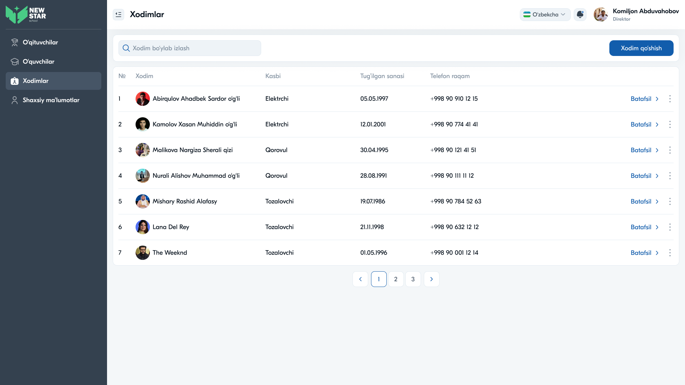

# 19 — Sahifa tahlili: Xodimlar



## Maqsad
Maktabning texnik (nopedagogik) xodimlari ma'lumotlar bazasini boshqarish: elektrik, qorovul, tozalovchi va boshqalar.

## Kim ko'radi
Direktor (Xodimlar — Direktor menyusida). Admin'da bu modul ko'rinmaydi (Direktor mas'uliyati).

---

## Layout tahlili

```
Xodimlar
[🔍 Xodim bo'ylab izlash ]                       [+ Xodim qo'shish]
┌──────────────────────────────────────────────────────────────┐
│ №  Xodim            Kasbi       Tug'ilgan    Telefon         ⋮ │
├──────────────────────────────────────────────────────────────┤
│ 1  [👤] Abirqulov... Elektrchi   05.05.1997  +998 90 910...  Batafsil ⋮│
│ 2  [👤] Kamolov X.   Elektrchi   12.01.2001  ...            Batafsil ⋮│
│ 3  [👤] Malikova N.  Qorovul     30.04.1995  ...            Batafsil ⋮│
│ ...  Tozalovchi ...                                          │
└──────────────────────────────────────────────────────────────┘
                          ‹ 1 2 3 ›
```

### Jadval ustunlari
| Ustun | Tavsif |
|-------|--------|
| № | Tartib |
| Xodim | Avatar + F.I.Sh |
| Kasbi | Elektrchi / Qorovul / Tozalovchi |
| Tug'ilgan sanasi | Sana |
| Telefon raqam | +998 ... |
| Batafsil | Profil |
| `⋮` | Tahrirlash / O'chirish |

---

## Komponentlar
Search ("Xodim bo'ylab izlash") · "Xodim qo'shish" tugma · Table (avatar, "Batafsil", `⋮`) · Pagination.

Struktura O'qituvchilar moduliga juda o'xshash, lekin "Fan" o'rniga "Kasbi" ustuni.

---

## Interaksiyalar

1. **Qidiruv** — xodim ismi bo'yicha
2. **"Xodim qo'shish"** — yangi xodim formasi
3. **"Batafsil"** — xodim profili
4. **`⋮`** — Tahrirlash / O'chirish

---

## UX qaydlar

- ✅ O'qituvchilar moduli bilan bir xil andoza — o'rganish oson (izchillik)
- ✅ "Kasbi" ustuni texnik xodimlar uchun mantiqiy
- ⚠️ **Tavsiya:** kasb bo'yicha filtr (dropdown) qo'shish — o'qituvchilardagidek
- ⚠️ **Tavsiya:** ish jadvali yoki smena ma'lumoti (qorovul/tozalovchi uchun)
- ⚠️ **Tavsiya:** ish boshlagan sana (ish staji)

---

## Accessibility qaydlar

- Jadval semantikasi (`<th scope>`)
- Telefon `tel:` havola
- "Batafsil" kontekstli `aria-label`

---

⬅️ [18 — Fanlar](18-Sahifa-Fanlar.md) · ➡️ [20 — Davomat](20-Sahifa-Davomat.md)
