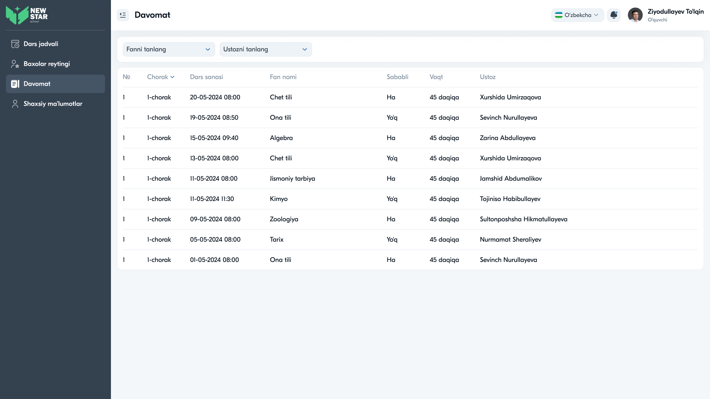

# 20 — Sahifa tahlili: Davomat



## Maqsad
O'quvchining darslarga davomat (yo'qlama) yozuvlarini ko'rsatish: qaysi darsda qatnashmagan, sababli yoki sababsiz ekani.

## Kim ko'radi
O'quvchi (o'z davomati). Kelajakda o'qituvchi davomat belgilashi mumkin.

---

## Layout tahlili

```
Davomat
[Fanni tanlang ▾]  [Ustozni tanlang ▾]
┌───────────────────────────────────────────────────────────────────────┐
│ №  Chorak    Dars sanasi       Fan nomi      Sababli  Vaqt      Ustoz   │
├───────────────────────────────────────────────────────────────────────┤
│ 1  1-chorak  20-05-2024 08:00  Chet tili     Ha       45 daqiqa X. Umirzaqova│
│ 1  1-chorak  19-05-2024 08:50  Ona tili      Yo'q     45 daqiqa S. Nurullayeva│
│ ...                                                                     │
└───────────────────────────────────────────────────────────────────────┘
```

### Jadval ustunlari
| Ustun | Tavsif |
|-------|--------|
| № | Tartib |
| Chorak | 1–4 chorak |
| Dars sanasi | Sana + vaqt |
| Fan nomi | Fan |
| Sababli | **Ha** (sababli) / **Yo'q** (sababsiz) |
| Vaqt | Dars davomiyligi (45 daqiqa) |
| Ustoz | O'qituvchi ismi |

---

## Komponentlar

| Komponent | Tafsilot |
|-----------|----------|
| Dropdown "Fanni tanlang" | fan bo'yicha filtr |
| Dropdown "Ustozni tanlang" | o'qituvchi bo'yicha filtr |
| Table | davomat yozuvlari |
| "Chorak" ustuni | saralash/filtr (`▾`) |

---

## Interaksiyalar

1. **Fan filtri** — tanlangan fan davomati
2. **Ustoz filtri** — tanlangan o'qituvchi darslari
3. **Chorak saralash** — chorak bo'yicha

---

## UX qaydlar

- ✅ "Sababli" ustuni — ota-ona/o'quvchi uchun muhim
- ✅ Filtrlar — ko'p yozuvni toraytirish
- ⚠️ **Tavsiya:** "Sababli" ustunini **rangli pill** qilish — Ha (yashil), Yo'q (qizil) — tezroq o'qiladi
- ⚠️ **Tavsiya:** umumiy statistika qo'shish (jami qoldirilgan darslar, % davomat)
- ⚠️ **Tavsiya:** sababli qoldirilganlarga sabab/izoh (kasallik, ruxsat)
- ⚠️ **Tavsiya:** "№" ustuni har qatorda "1" — bu xato, ketma-ket raqamlanishi kerak

---

## Accessibility qaydlar

- "Ha/Yo'q" faqat rang bilan emas, matn bilan ham (rang ko'r foydalanuvchilar uchun)
- Jadval `<th scope>` bilan
- Filtrlar label bilan
- Sana/vaqt formati izchil

---

⬅️ [19 — Xodimlar](19-Sahifa-Xodimlar.md) · ➡️ [21 — Baholar reytingi](21-Sahifa-Baholar-reytingi.md)
