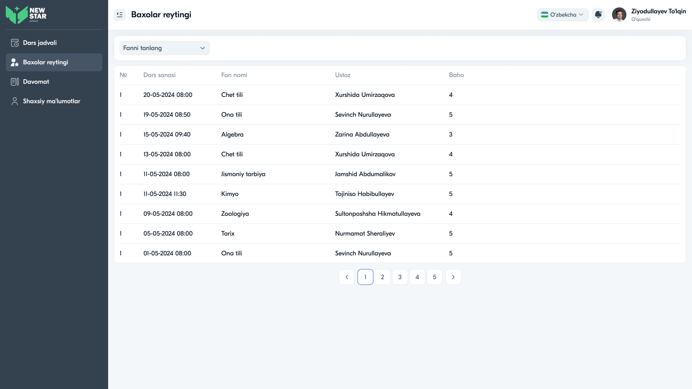

# 21 — Sahifa tahlili: Baholar reytingi



## Maqsad
O'quvchining olgan baholarini ko'rsatish: qaysi darsda, kim qo'ygan va qanday baho. 5 ballik tizim.

## Kim ko'radi
O'quvchi (o'z baholari). Direktor uchun "Reyting" moduli — umumiy reyting/statistika ko'rinishi.

---

## Layout tahlili

```
Baxolar reytingi
[Fanni tanlang ▾]
┌──────────────────────────────────────────────────────────────┐
│ №  Dars sanasi       Fan nomi      Ustoz              Baho     │
├──────────────────────────────────────────────────────────────┤
│ 1  20-05-2024 08:00  Chet tili     X. Umirzaqova      4        │
│ 1  19-05-2024 08:50  Ona tili      S. Nurullayeva     5        │
│ 1  15-05-2024 09:40  Algebra       Z. Abdullayeva     3        │
│ ...                                                            │
└──────────────────────────────────────────────────────────────┘
                          ‹ 1 2 3 4 5 ›
```

### Jadval ustunlari
| Ustun | Tavsif |
|-------|--------|
| № | Tartib |
| Dars sanasi | Sana + vaqt |
| Fan nomi | Fan |
| Ustoz | Baho qo'ygan o'qituvchi |
| Baho | 3 / 4 / 5 (5 ballik) |

---

## Komponentlar
Dropdown "Fanni tanlang" (filtr) · Table · Pagination.

Struktura Davomat moduliga o'xshash (sana, fan, ustoz ustunlari bir xil), lekin "Baho" ustuni bilan.

---

## Interaksiyalar

1. **Fan filtri** — tanlangan fan baholari
2. **Sahifalash** — baholar tarixini ko'rish

---

## UX qaydlar

- ✅ Soddalik — o'quvchi baholarini tez ko'radi
- ✅ Ustoz ismi har bahoda — shaffoflik
- ⚠️ **Tavsiya:** baholarni **rangli pill** bilan ajratish — 5 (yashil), 4 (ko'k), 3 (sariq), 2 (qizil)
- ⚠️ **Tavsiya:** o'rtacha baho (GPA) va fan bo'yicha o'rtacha statistika
- ⚠️ **Tavsiya:** baho turi (joriy, nazorat, choraklik, yillik) ustuni
- ⚠️ **Tavsiya:** grafik/diagramma (baholar dinamikasi vaqt bo'yicha)
- ⚠️ **Tavsiya:** "№" ketma-ket bo'lsin (hozir hamma "1")

---

## Accessibility qaydlar

- Baho faqat rang bilan emas, raqam bilan ham (rang ko'rlar uchun)
- Jadval `<th scope>` bilan
- Baholar `tabular-nums` bilan
- Filtr label bilan

---

## Direktor "Reyting" ko'rinishi
Direktor menyusidagi "Reyting" — bu butun maktab/sinflar bo'yicha umumiy o'zlashtirish reytingi (alohida ko'rinish). Ehtimoliy tarkib: sinflar reytingi, o'qituvchilar samaradorligi, o'rtacha baholar — kelajakdagi kengaytirish.

---

⬅️ [20 — Davomat](20-Sahifa-Davomat.md) · ➡️ [22 — Shaxsiy ma'lumotlar](22-Sahifa-Shaxsiy-malumotlar.md)
