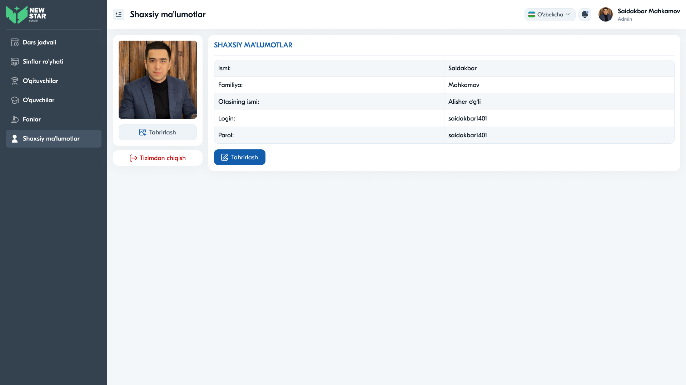
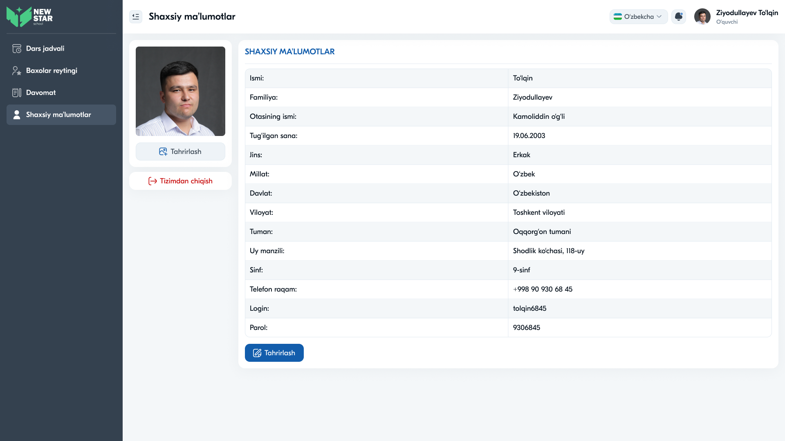
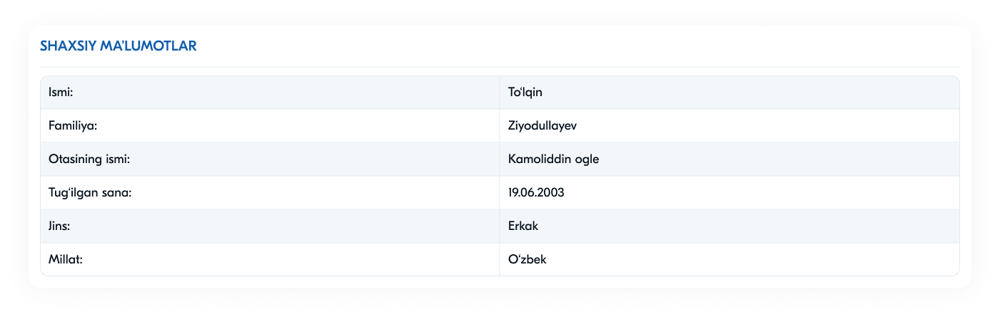
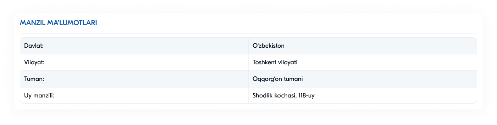

# 22 — Sahifa tahlili: Shaxsiy ma'lumotlar (Profil)



## Maqsad
Foydalanuvchining shaxsiy profilini ko'rsatish va tahrirlash imkonini berish. Shu yerda **tizimdan chiqish** ham mavjud.

## Kim ko'radi
Barcha rollar (o'z profilini). Ko'rsatiladigan maydonlar rolga qarab farq qiladi.

---

## Layout tahlili (2 ustun)

```
Shaxsiy ma'lumotlar
┌──────────────┐  SHAXSIY MA'LUMOTLAR
│   [profil    │  Ismi:           Saidakbar
│    rasmi]    │  Familiya:       Mahkamov
│              │  Otasining ismi: Alisher o'g'li
│ [Tahrirlash] │  Login:          saidakbar1401
├──────────────┤  Parol:          saidakbar1401
│[Tizimdan     │  [Tahrirlash]
│  chiqish]    │
└──────────────┘
```

- **Chap ustun:** profil rasmi + "Tahrirlash" + "Tizimdan chiqish" (qizil)
- **O'ng ustun:** "SHAXSIY MA'LUMOTLAR" sarlavhasi + ma'lumotlar jadvali (zebra) + "Tahrirlash"

---

## Maydonlar — rolga qarab

### Admin / Direktor / Zavuch (qisqa)
Ismi · Familiya · Otasining ismi · Login · Parol (5 maydon)

### O'quvchi (to'liq)


Ismi · Familiya · Otasining ismi · Tug'ilgan sana · Jins · Millat · Davlat · Viloyat · Tuman · Uy manzili · **Sinf** · Telefon raqam · Login · Parol (14 maydon)

---

## Komponentlar

| Komponent | Tafsilot |
|-----------|----------|
| Profil rasm karta | rasm + "Tahrirlash" + "Tizimdan chiqish" |
| "Tahrirlash" (kichik) | ikkilamchi tugma (rasm ostida) |
| "Tizimdan chiqish" | xavf tugma (qizil matn + ikonka) |
| Ma'lumotlar jadvali | label : qiymat (zebra qatorlar) |
| "Tahrirlash" (asosiy) | ko'k tugma (jadval ostida) |

### Detal karta fragmentlari
Profil ma'lumotlari mantiqiy bloklarga bo'lingan (komponent sifatida):




---

## Interaksiyalar

1. **"Tahrirlash"** — maydonlarni o'zgartirish (input formaga aylanadi yoki modal)
2. **"Tizimdan chiqish"** — token o'chiriladi → Login sahifasiga
3. **Rasm "Tahrirlash"** — profil rasmini yangilash

---

## UX qaydlar

- ✅ Zebra jadval — o'qish oson
- ✅ "Tizimdan chiqish" qizil va ajralib turadi (lekin xavfsiz joyda)
- ✅ Profil rasmi shaxsiylashtiradi
- 🔴 **Xavfsizlik:** **parol ochiq matnda** ko'rsatilgan — eng jiddiy muammo. Parol hech qachon ko'rsatilmasligi kerak. Buning o'rniga "Parolni o'zgartirish" tugmasi bo'lsin. Bazada parol **bcrypt hash** holatida saqlanishi shart
- ⚠️ **Tavsiya:** "Tizimdan chiqish"ga tasdiq (tasodifiy bosishdan)
- ⚠️ **Tavsiya:** tahrirlashda saqlash/bekor qilish tugmalari aniq bo'lsin

---

## Accessibility qaydlar

- "Tizimdan chiqish" tugmasi aniq `aria-label`
- Profil rasm `alt` matni ("Foydalanuvchi rasmi")
- Tahrirlash rejimida har maydon `<label>` bilan
- Jadval `<th scope="row">` (label ustuni)
- Fokus boshqaruvi (tahrirlash ochilganda birinchi maydonga)

---

⬅️ [21 — Baholar reytingi](21-Sahifa-Baholar-reytingi.md) · ➡️ [23 — Modal oynalar](23-Modal-oynalar.md)
