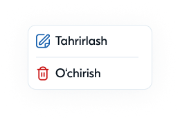
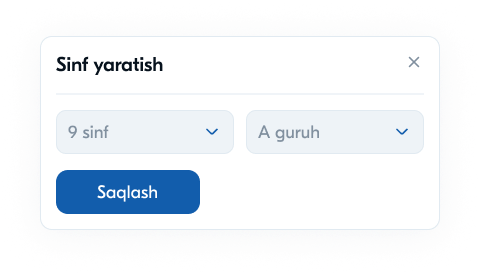
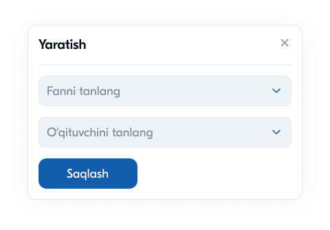

# 23 — Modal oynalar va dropdownlar

Tizimda ma'lumot yaratish/tahrirlash uchun modal oynalar va kontekst menyulardan foydalaniladi. Bular "Open" komponentlar to'plamida jamlangan.

---

## 1. Kontekst menyu (`⋮` Kebab)

Jadval/kartochka qatorlaridagi `⋮` tugma bosilganda paydo bo'ladi.



```
┌────────────────┐
│ ✏  Tahrirlash  │  ← ko'k
│ ─────────────  │
│ 🗑  O'chirish   │  ← qizil
└────────────────┘
```

- **Tahrirlash** — yozuvni o'zgartirish modali
- **O'chirish** — yozuvni o'chirish (tasdiq bilan)

---

## 2. "Sinf yaratish" modali



```
┌──────────────────────────── ✕ ┐
│  Sinf yaratish                  │
│ ──────────────────────────────  │
│  [ 9 sinf  ▾ ]   [ A guruh  ▾ ] │
│  [    Saqlash    ]              │
└─────────────────────────────────┘
```

| Element | Tavsif |
|---------|--------|
| Sarlavha | "Sinf yaratish" + `✕` |
| Dropdown 1 | Sinf raqami (`9 sinf`) |
| Dropdown 2 | Guruh (`A guruh`) |
| Tugma | "Saqlash" (ko'k) |

---

## 3. "Yaratish" modali (fan + o'qituvchi)



```
┌──────────────────────────── ✕ ┐
│  Yaratish                       │
│ ──────────────────────────────  │
│  [ Fanni tanlang        ▾ ]     │
│  [ O'qituvchini tanlang ▾ ]     │
│  [    Saqlash    ]              │
└─────────────────────────────────┘
```

- Sinfga fan va unga mas'ul o'qituvchini biriktirish uchun
- Ikki dropdown: fan + o'qituvchi

---

## 4. Modal tuzilishi (umumiy andoza)

```
┌─────────────────────────────────── ✕ ┐
│  [Sarlavha]                            │  ← bold, chap
│ ───────────────────────────────────── │  ← ajratuvchi
│  [Forma maydonlari]                    │
│                                        │
│  [    Asosiy tugma (Saqlash)    ]      │  ← ko'k
└────────────────────────────────────────┘
```

### Spetsifikatsiya
```
kenglik: ~480px
fon: #FFFFFF, radius-lg (12px)
soya: shadow-modal
overlay: rgba(38,48,57,.45)
sarlavha: 16–18px / 700
✕ tugma: o'ng tepada, kulrang
saqlash tugma: ko'k, chap yoki to'liq kenglik
```

---

## 5. Modal holatlari va xulq-atvor

| Holat | Xulq |
|-------|------|
| Ochilish | fade + scale (220ms) — [08-Animatsiyalar.md](08-Animatsiyalar.md) |
| Yopilish | `✕`, `Esc`, overlay bosish, "Saqlash"dan keyin |
| Validatsiya | bo'sh maydon — xato ko'rsatish, saqlash bloklanadi |
| Saqlash | loading → muvaffaqiyat (toast) → modal yopiladi → ro'yxat yangilanadi |

---

## 6. Modal turlari (inventar)

| Modal | Maqsad | Maydonlar |
|-------|--------|-----------|
| Sinf yaratish | Yangi sinf | sinf raqami, guruh |
| Yaratish (fan-ustoz) | Sinfga fan biriktirish | fan, o'qituvchi |
| O'qituvchi qo'shish | Yangi o'qituvchi | F.I.Sh, fan, sana, telefon, login... |
| O'quvchi qo'shish | Yangi o'quvchi | F.I.Sh, sinf, guruh, telefon, ota-ona... |
| Fan qo'shish | Yangi fan | fan nomi |
| Xodim qo'shish | Yangi xodim | F.I.Sh, kasb, sana, telefon |
| Tahrirlash | Mavjudni o'zgartirish | tegishli maydonlar |
| O'chirishni tasdiqlash | Tasdiq | "Ha / Yo'q" |

> Eslatma: "qo'shish" formalar modal yoki alohida sahifa sifatida amalga oshirilishi mumkin. Sodda formalar (sinf, fan) — modal; uzun formalar (o'quvchi/o'qituvchi) — alohida sahifa tavsiya etiladi.

---

## 7. Dropdown (Select) xulq-atvori

Modallar ichidagi dropdownlar:
- Bosilganda ro'yxat ochiladi (`z-dropdown`)
- Tanlash → dropdown yopiladi, qiymat ko'rsatiladi
- Misol qiymatlar: `9 sinf`, `A guruh`, fanlar, o'qituvchilar

---

## 8. Accessibility (modal uchun muhim)

- **Focus trap** — fokus modal ichida qoladi (Tab tashqariga chiqmaydi)
- **Esc** bilan yopiladi
- Ochilganda fokus birinchi maydonga, yopilganda chaqirgan tugmaga qaytadi
- `role="dialog"` + `aria-modal="true"` + `aria-labelledby` (sarlavha)
- Overlay ostidagi kontent `aria-hidden`

```jsx
// Modal uchun fokus boshqaruvi (soddalashtirilgan)
useEffect(() => {
  const onKey = (e) => { if (e.key === 'Escape') onClose(); };
  document.addEventListener('keydown', onKey);
  firstFieldRef.current?.focus();
  return () => document.removeEventListener('keydown', onKey);
}, []);
```

---

⬅️ [22 — Shaxsiy ma'lumotlar](22-Sahifa-Shaxsiy-malumotlar.md) · ➡️ [24 — Foydalanuvchi rollari](24-Foydalanuvchi-rollari.md)
