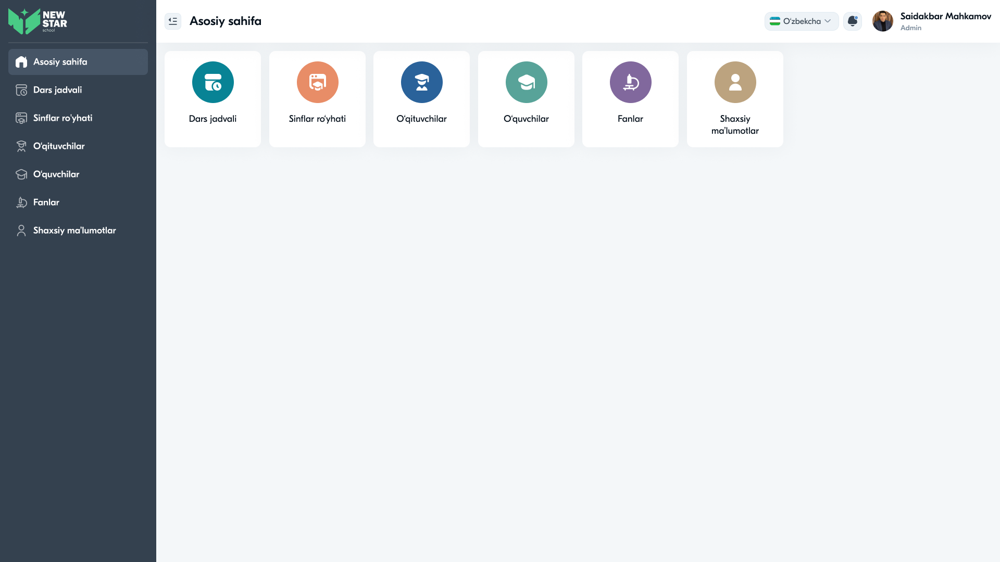
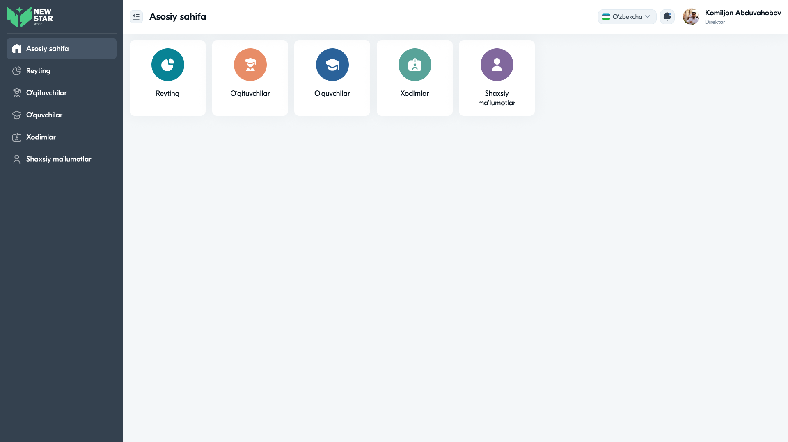
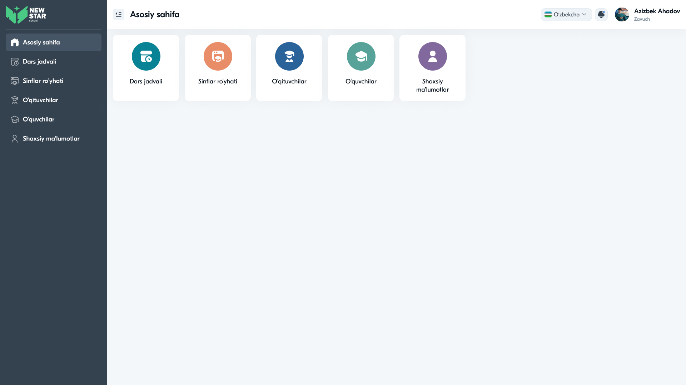
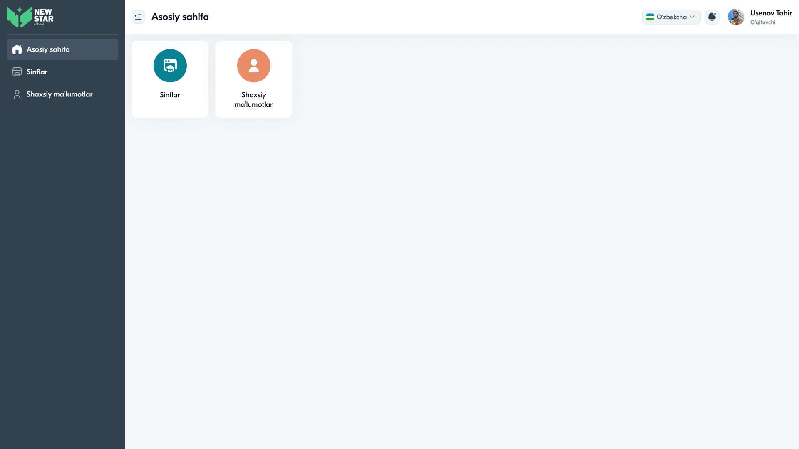
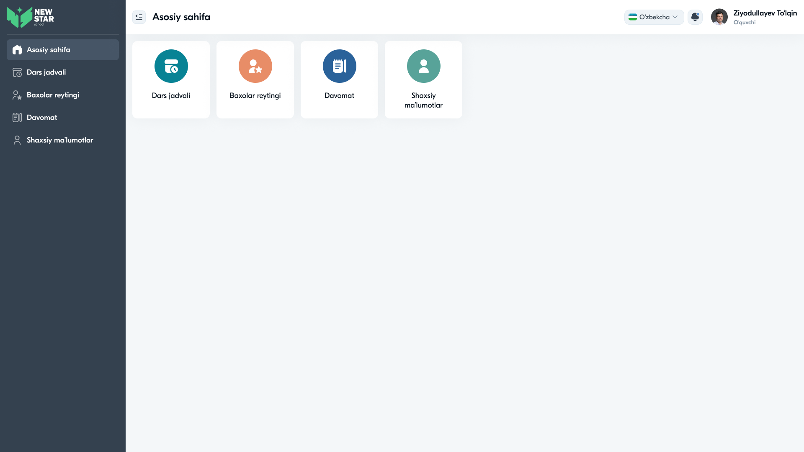

# 24 — Foydalanuvchi rollari va huquqlar

Tizim **5 ta rol** uchun moslashtirilgan. Har bir rol o'z menyusi, kartochkalari va huquqlariga ega (Role-Based Access Control — RBAC).

---

## 1. Rollar umumiy jadvali

| Rol | Tavsif | Foydalanuvchi (namuna) |
|-----|--------|------------------------|
| **Admin** | Tizim ma'muri — to'liq boshqaruv | Saidakbar Mahkamov |
| **Direktor** | Maktab rahbari — nazorat | Komiljon Abduvahobov |
| **Zavuch** | O'quv ishlari bo'yicha o'rinbosar | Azizbek Ahadov |
| **O'qituvchi** | Fan o'qituvchisi | Usenov Tohir |
| **O'quvchi** | Talaba | Ziyodullayev To'lqin |

---

## 2. Modul kirish matritsasi (RBAC)

| Modul | Admin | Direktor | Zavuch | O'qituvchi | O'quvchi |
|-------|:-----:|:--------:|:------:|:----------:|:--------:|
| Asosiy sahifa | ✅ | ✅ | ✅ | ✅ | ✅ |
| Dars jadvali | ✅ | — | ✅ | — | ✅ (o'ziniki) |
| Sinflar ro'yhati | ✅ | — | ✅ | ✅ (o'ziniki) | — |
| O'qituvchilar | ✅ | ✅ (ko'rish) | ✅ | — | — |
| O'quvchilar | ✅ | ✅ (ko'rish) | ✅ | — | — |
| Fanlar | ✅ | — | — | — | — |
| Xodimlar | — | ✅ | — | — | — |
| Reyting | — | ✅ | — | — | — |
| Davomat | — | — | — | — | ✅ |
| Baxolar reytingi | — | — | — | — | ✅ |
| Shaxsiy ma'lumotlar | ✅ | ✅ | ✅ | ✅ | ✅ |

> ✅ = to'liq · (ko'rish) = faqat o'qish · (o'ziniki) = faqat o'ziga tegishli · — = kirish yo'q

---

## 3. Har bir rol batafsil

### 3.1. Admin


**Vazifa:** tizimning o'quv qismini to'liq boshqarish.
**Menyu:** Asosiy sahifa · Dars jadvali · Sinflar ro'yhati · O'qituvchilar · O'quvchilar · Fanlar · Shaxsiy ma'lumotlar.
**Huquqlar:** sinf/o'qituvchi/o'quvchi/fan yaratish, tahrirlash, o'chirish; dars jadvalini tuzish.
**Profil:** qisqa (Ismi, Familiya, Otasining ismi, Login, Parol).

### 3.2. Direktor


**Vazifa:** maktabni nazorat qilish, xodimlarni boshqarish.
**Menyu:** Asosiy sahifa · Reyting · O'qituvchilar · O'quvchilar · Xodimlar · Shaxsiy ma'lumotlar.
**Huquqlar:** Xodimlarni boshqarish (to'liq); o'qituvchi/o'quvchilarni ko'rish; umumiy reyting.
**Farqi:** yagona rol — **Xodimlar** va **Reyting** ga kirishi bor; Dars jadvali/Fanlar yo'q.

### 3.3. Zavuch


**Vazifa:** o'quv jarayonini tashkil qilish.
**Menyu:** Asosiy sahifa · Dars jadvali · Sinflar ro'yhati · O'qituvchilar · O'quvchilar · Shaxsiy ma'lumotlar.
**Huquqlar:** Admin bilan o'xshash, lekin Fanlarsiz.

### 3.4. O'qituvchi


**Vazifa:** o'z sinflari bilan ishlash.
**Menyu:** Asosiy sahifa · Sinflar · Shaxsiy ma'lumotlar (eng cheklangan menyu — 2 modul).
**Huquqlar:** faqat o'ziga biriktirilgan sinflarni ko'rish (kelajakda: baho qo'yish, davomat belgilash).

### 3.5. O'quvchi


**Vazifa:** o'z o'quv ma'lumotlarini kuzatish.
**Menyu:** Asosiy sahifa · Dars jadvali · Baxolar reytingi · Davomat · Shaxsiy ma'lumotlar.
**Huquqlar:** faqat ko'rish (o'z jadvali, baholari, davomati, profili).
**Profil:** to'liq (14 maydon — shaxsiy, manzil, sinf, aloqa).

---

## 4. Huquqlar amaliyoti (frontend + backend)

### Frontend
- Login javobidagi `role` asosida menyu va kartochkalar render qilinadi
- Ruxsatsiz route'ga kirishda yo'naltirish (`<ProtectedRoute>`)

### Backend (asosiy himoya)
- Har endpoint rolga tekshiriladi (`@PreAuthorize("hasRole('ADMIN')")`)
- Frontend yashirishi yetarli emas — backend qatlamida majburiy nazorat (→ [36-Backend-security-jwt.md](36-Backend-security-jwt.md))

```java
// Spring Security misol
@PreAuthorize("hasAnyRole('ADMIN','ZAVUCH')")
@PostMapping("/api/classes")
public ResponseEntity<ClassDto> create(@RequestBody CreateClassDto dto) { ... }
```

---

## 5. Rollar ENUM (kelishilgan nomlar)

```
ROLE_ADMIN     → Admin
ROLE_DIRECTOR  → Direktor
ROLE_ZAVUCH    → Zavuch (Deputy)
ROLE_TEACHER   → O'qituvchi
ROLE_STUDENT   → O'quvchi
```

---

⬅️ [23 — Modal oynalar](23-Modal-oynalar.md) · ➡️ [25 — User flow diagramlar](25-User-flow.md)
