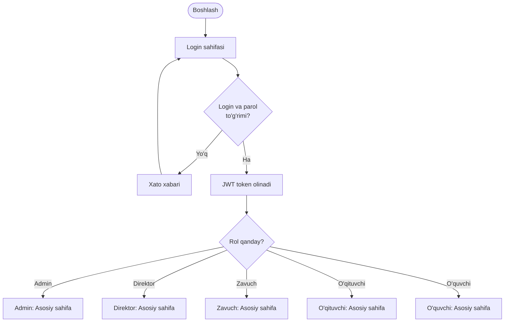
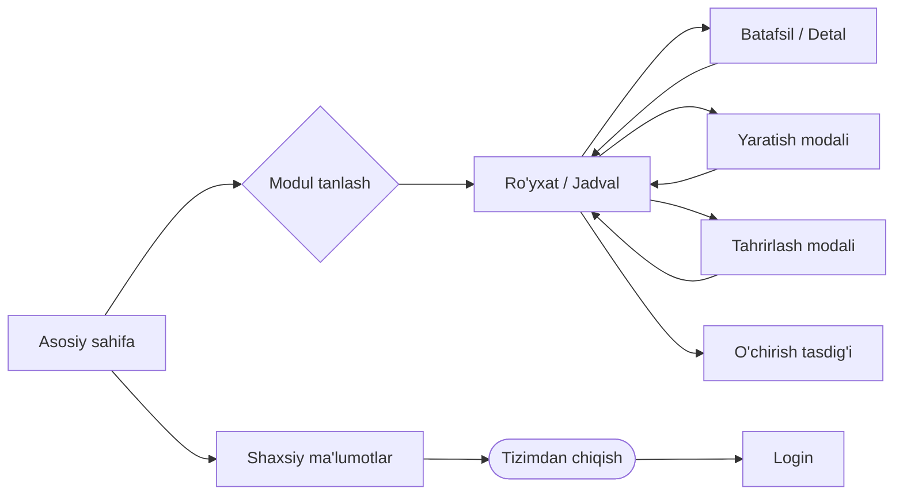
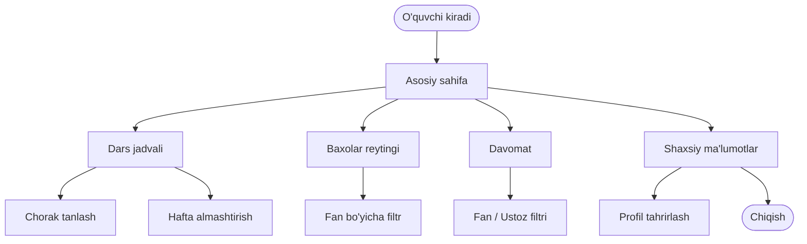
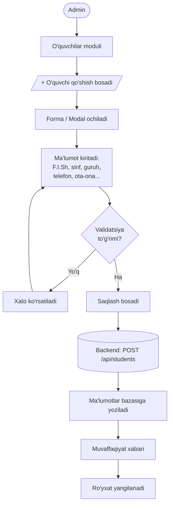
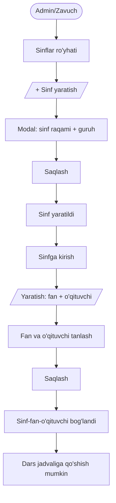
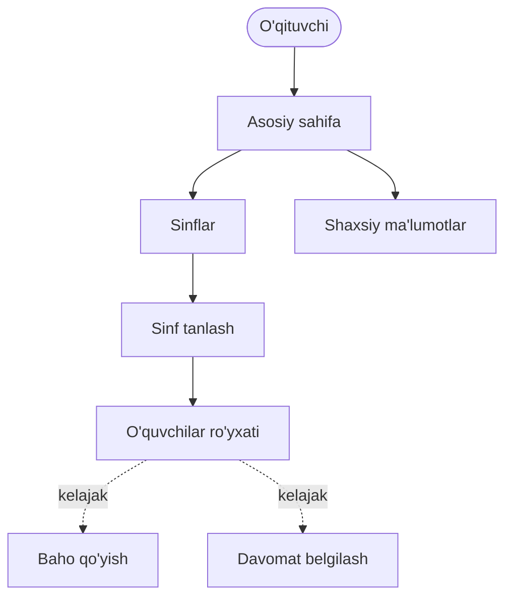
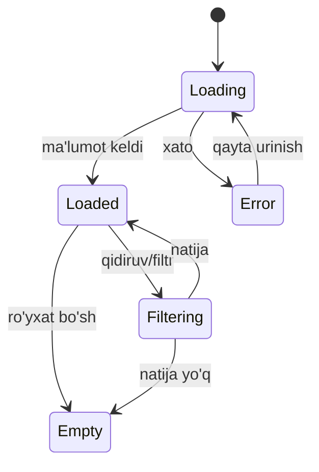
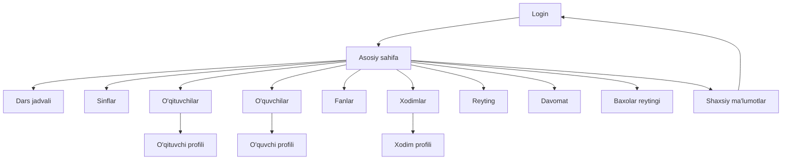

# 25 — User Flow diagramlari

Quyida tizimning asosiy foydalanuvchi oqimlari **Mermaid** diagrammalarida berilgan. (GitHub, Obsidian, VS Code va boshqa ko'plab muharrirlar Mermaid'ni avtomatik render qiladi.)

---

## 1. Umumiy autentifikatsiya oqimi



---

## 2. Umumiy navigatsiya oqimi



---

## 3. O'quvchi oqimi (Student journey)



---

## 4. Admin: O'quvchi qo'shish oqimi



---

## 5. Admin: Sinf yaratish va fan biriktirish



---

## 6. O'qituvchi oqimi



---

## 7. Ma'lumot o'chirish oqimi (xavfsiz)

```mermaid
flowchart LR
    A[Qatordagi ⋮] --> B[Kontekst menyu]
    B --> C[/"O'chirish"/]
    C --> D{Tasdiq modali:\n"Rostdan o'chirilsinmi?"}
    D -- Yo'q --> E[Bekor qilindi]
    D -- Ha --> F[(DELETE /api/.../id)]
    F --> G[Yozuv o'chirildi]
    G --> H[Ro'yxat yangilanadi + toast]
```

---

## 8. Sahifa holatlari (state machine — ro'yxat sahifasi)



---

## 9. Tizimning yuqori darajadagi oqimi (sitemap)



---

⬅️ [24 — Foydalanuvchi rollari](24-Foydalanuvchi-rollari.md) · ➡️ [26 — Admin workflow](26-Admin-workflow.md)
