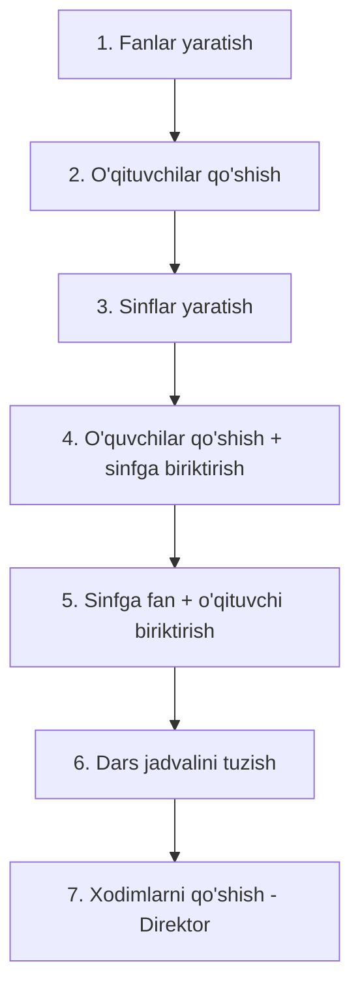
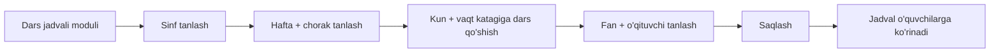

# 26 — Admin Workflow (Ma'mur ish jarayoni)

Bu bo'lim Admin (va qisman Zavuch/Direktor) tizimni qanday boshqarishini — o'quv yilini tashkil qilishdan kundalik amallargacha — tavsiflaydi.

---

## 1. O'quv yilini boshlash (dastlabki sozlash)

To'g'ri ketma-ketlik muhim, chunki modullar bir-biriga bog'liq:

| Qadam | Modul | Mas'ul | Natija |
|-------|-------|--------|--------|
| 1 | Fanlar | Admin | Fanlar bazasi tayyor |
| 2 | O'qituvchilar | Admin/Zavuch | O'qituvchilar kiritilgan |
| 3 | Sinflar | Admin/Zavuch | Sinf+guruhlar tuzilgan |
| 4 | O'quvchilar | Admin/Zavuch | O'quvchilar sinflarga taqsimlangan |
| 5 | Sinf detali | Admin/Zavuch | Har sinfga fan-ustoz bog'langan |
| 6 | Dars jadvali | Zavuch/Admin | Haftalik jadval tuzilgan |
| 7 | Xodimlar | Direktor | Texnik xodimlar kiritilgan |

---

## 2. Kundalik amallar (CRUD)

Har modul bir xil **CRUD** andozasiga ega:

| Amal | Qadam | Komponent |
|------|-------|-----------|
| **Create** | "+ Qo'shish" → forma → Saqlash | Modal/sahifa |
| **Read** | Ro'yxat / Batafsil | Table / Profil |
| **Update** | `⋮` → Tahrirlash → Saqlash | Modal |
| **Delete** | `⋮` → O'chirish → Tasdiq | Tasdiq modali |
| **Search** | Qidiruv maydoni | Search |
| **Filter** | Dropdown filtr | Select |

---

## 3. Yangi o'quvchini ro'yxatga olish (to'liq jarayon)

1. **O'quvchilar** moduliga kirish
2. **"+ O'quvchi qo'shish"** bosish
3. Ma'lumotlarni kiritish:
   - Shaxsiy: Ism, Familiya, Otasining ismi, Tug'ilgan sana, Jins, Millat
   - Manzil: Davlat, Viloyat, Tuman, Uy manzili
   - O'quv: Sinf, Guruh
   - Aloqa: Telefon, Ota-ona telefoni
   - Tizim: Login, Parol (avtomatik generatsiya tavsiya etiladi)
4. **Saqlash** → tizim o'quvchini bazaga yozadi va login yaratadi
5. O'quvchi o'z login/paroli bilan tizimga kira oladi

> 🔐 **Muhim:** parol avtomatik generatsiya qilinib, **hash** holatida saqlanishi va o'quvchiga xavfsiz yetkazilishi kerak.

---

## 4. Dars jadvalini tuzish

**Shartlar:** sinfga avval fan va o'qituvchi biriktirilgan bo'lishi kerak (2-bosqich).

---

## 5. Rollar bo'yicha mas'uliyat taqsimoti

| Vazifa | Admin | Direktor | Zavuch |
|--------|:-----:|:--------:|:------:|
| Fanlar boshqaruvi | ✅ | — | — |
| Sinflar boshqaruvi | ✅ | — | ✅ |
| O'qituvchilar | ✅ | ko'rish | ✅ |
| O'quvchilar | ✅ | ko'rish | ✅ |
| Dars jadvali | ✅ | — | ✅ |
| Xodimlar | — | ✅ | — |
| Umumiy reyting/nazorat | — | ✅ | — |

---

## 6. Ma'lumotlar yaxlitligi qoidalari (business rules)

1. **Fan o'chirish** — agar fan jadvalda/bahoda ishlatilsa, o'chirishdan oldin ogohlantirish yoki bloklash.
2. **Sinf o'chirish** — sinfda o'quvchilar bo'lsa, avval ko'chirish kerak.
3. **O'qituvchi o'chirish** — jadvaldagi darslari qayta tayinlanishi kerak.
4. **Login takrorlanmasligi** — har foydalanuvchi login'i noyob.
5. **Telefon formati** — `+998 XX XXX XX XX` validatsiyasi.

---

## 7. Tavsiya etilgan kelajak funksiyalari (admin uchun)

- 📊 **Dashboard statistikasi** — jami o'quvchilar/o'qituvchilar, faollik
- 📥 **Ommaviy import** — Excel/CSV orqali o'quvchilarni bir vaqtda yuklash
- 📤 **Eksport** — ro'yxat va hisobotlarni PDF/Excel'ga chiqarish
- 🔔 **Bildirishnomalar** — ota-onalarga SMS/push (davomat, baho)
- 📅 **Akademik kalendar** — choraklar, ta'tillar, bayramlar
- 🗂 **Audit log** — kim qachon nima o'zgartirgani (mas'uliyat)
- 👥 **Klass rahbar** — har sinfga rahbar o'qituvchi biriktirish

---

⬅️ [25 — User flow](25-User-flow.md) · ➡️ [27 — Frontend: Arxitektura](27-Frontend-arxitektura.md)
