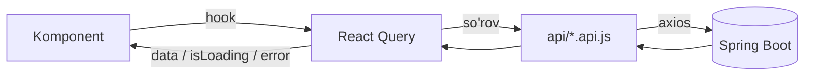

# 27 — Frontend: Arxitektura (React, JSX)

> **Eslatma:** loyiha **React (JavaScript / JSX)** da quriladi — **TypeScript (.tsx) ishlatilmaydi**. Barcha komponentlar `.jsx` fayllarda.

---

## 1. Texnologiya steki

| Qatlam | Tanlov | Sabab |
|--------|--------|-------|
| Kutubxona | **React 18** (JSX) | Komponentli, keng hamjamiyat |
| Build | **Vite** | Tez, sodda konfiguratsiya |
| Routing | **React Router v6** | Standart yo'naltirish |
| Server holati | **TanStack Query** (React Query) | API kesh, loading/error |
| Forma | **React Hook Form** | Yengil, validatsiya |
| HTTP | **Axios** | Interceptor (token) qulay |
| Ikonkalar | **lucide-react** | Dizaynga mos chiziqli to'plam |
| Uslub | **CSS Modules** + token o'zgaruvchilari | Sof CSS, izolyatsiya |
| i18n | **react-i18next** | Ko'p tillilik (UZ/RU/EN) |

> Holat boshqaruvi uchun og'ir kutubxona (Redux) shart emas — server holati React Query, lokal holat `useState`/`useContext` yetarli.

---

## 2. Papka tuzilishi

```
src/
├── main.jsx                  # kirish nuqtasi
├── App.jsx                   # router + provayderlar
│
├── app/
│   ├── router.jsx            # marshrutlar
│   ├── ProtectedRoute.jsx    # himoyalangan route
│   └── queryClient.js        # React Query sozlamasi
│
├── assets/
│   └── styles/
│       ├── tokens.css        # design tokenlar (CSS o'zgaruvchilari)
│       └── global.css        # global uslublar
│
├── api/
│   ├── axios.js              # axios instance + interceptor
│   ├── auth.api.js
│   ├── students.api.js
│   ├── teachers.api.js
│   ├── classes.api.js
│   ├── subjects.api.js
│   ├── staff.api.js
│   ├── schedule.api.js
│   ├── grades.api.js
│   └── attendance.api.js
│
├── components/
│   ├── layout/
│   │   ├── AppShell.jsx
│   │   ├── Sidebar.jsx
│   │   ├── Topbar.jsx
│   │   └── PageHeader.jsx
│   └── ui/
│       ├── Button.jsx
│       ├── Input.jsx
│       ├── Select.jsx
│       ├── SearchField.jsx
│       ├── Card.jsx
│       ├── ModuleCard.jsx
│       ├── ClassCard.jsx
│       ├── Table.jsx
│       ├── Pagination.jsx
│       ├── Modal.jsx
│       ├── ContextMenu.jsx
│       ├── Avatar.jsx
│       ├── Badge.jsx
│       ├── Breadcrumb.jsx
│       ├── Tabs.jsx
│       └── Spinner.jsx
│
├── features/
│   ├── auth/
│   │   ├── LoginPage.jsx
│   │   └── useAuth.js
│   ├── dashboard/DashboardPage.jsx
│   ├── schedule/SchedulePage.jsx
│   ├── classes/ ClassesPage.jsx, ClassDetailPage.jsx
│   ├── teachers/ TeachersPage.jsx, TeacherDetailPage.jsx
│   ├── students/ StudentsPage.jsx, StudentDetailPage.jsx
│   ├── subjects/SubjectsPage.jsx
│   ├── staff/ StaffPage.jsx, StaffDetailPage.jsx
│   ├── attendance/AttendancePage.jsx
│   ├── grades/GradesPage.jsx
│   └── profile/ProfilePage.jsx
│
├── context/
│   └── AuthContext.jsx        # foydalanuvchi + rol
│
├── hooks/
│   ├── useDebounce.js
│   └── usePagination.js
│
├── config/
│   └── navigation.js          # rolga mos menyu konfiguratsiyasi
│
└── utils/
    ├── formatPhone.js
    ├── formatDate.js
    └── constants.js
```

---

## 3. Arxitektura prinsiplari

1. **Feature-based** — har modul o'z papkasida (sahifa + logika).
2. **UI komponentlar "ahmoq" (presentational)** — props orqali, biznes-logikasiz.
3. **API qatlami ajratilgan** — komponentlar to'g'ridan-to'g'ri `fetch` qilmaydi.
4. **Tokenlar bitta manbada** — `tokens.css` (dizayn bilan sinxron).
5. **Rolga moslik** — `navigation.js` konfiguratsiyasi menyuni boshqaradi.

---

## 4. Ma'lumot oqimi



- Komponent → `useStudents()` (React Query hook) → `students.api.js` → axios → backend
- Kesh, qayta yuklash, loading/error avtomatik

---

## 5. Muhit o'zgaruvchilari (`.env`)

```env
VITE_API_BASE_URL=https://api.newstarschool.uz
VITE_DEFAULT_LANG=uz
```

```js
// api/axios.js da ishlatish
baseURL: import.meta.env.VITE_API_BASE_URL
```

---

## 6. main.jsx (kirish nuqtasi)

```jsx
import React from 'react';
import ReactDOM from 'react-dom/client';
import { BrowserRouter } from 'react-router-dom';
import { QueryClientProvider } from '@tanstack/react-query';
import { queryClient } from './app/queryClient';
import { AuthProvider } from './context/AuthContext';
import App from './App';
import './assets/styles/tokens.css';
import './assets/styles/global.css';

ReactDOM.createRoot(document.getElementById('root')).render(
  <React.StrictMode>
    <QueryClientProvider client={queryClient}>
      <BrowserRouter>
        <AuthProvider>
          <App />
        </AuthProvider>
      </BrowserRouter>
    </QueryClientProvider>
  </React.StrictMode>
);
```

---

⬅️ [26 — Admin workflow](26-Admin-workflow.md) · ➡️ [28 — Frontend: Tokenlar & CSS](28-Frontend-tokens-css.md)
