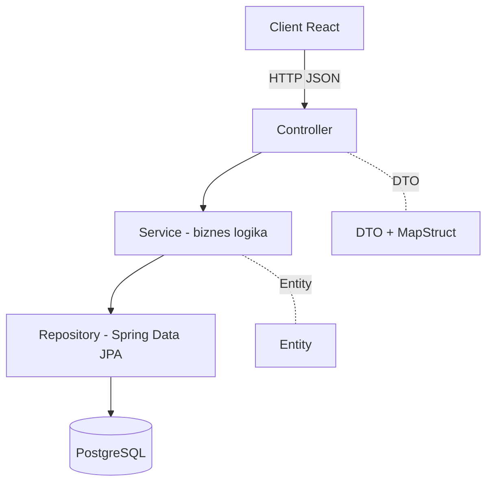

# 33 — Backend: Arxitektura (Java Spring Boot)

Backend **Java + Spring Boot** texnologiyasida, **PostgreSQL** ma'lumotlar bazasi bilan quriladi. Bu bo'limda umumiy arxitektura, paketlar va konfiguratsiya.

---

## 1. Texnologiya steki

| Qatlam | Tanlov |
|--------|--------|
| Til | **Java 17+** |
| Framework | **Spring Boot 3.x** |
| Web | Spring Web (REST) |
| Ma'lumot | Spring Data JPA (Hibernate) |
| Baza | **PostgreSQL 15+** |
| Xavfsizlik | Spring Security + **JWT** |
| Validatsiya | Jakarta Bean Validation |
| Migratsiya | Flyway (yoki Liquibase) |
| Mapping | MapStruct (DTO ↔ Entity) |
| Build | Maven yoki Gradle |
| Hujjat | springdoc-openapi (Swagger UI) |

---

## 2. Qatlamli arxitektura (layered)



| Qatlam | Mas'uliyat |
|--------|-----------|
| **Controller** | HTTP so'rovlar, validatsiya, DTO qaytarish |
| **Service** | Biznes-logika, tranzaksiya, qoidalar |
| **Repository** | Ma'lumot kirish (CRUD, query) |
| **Entity** | JPA jadval modellari |
| **DTO** | Tashqi shartnoma (Entity'ni yashiradi) |

---

## 3. Paket tuzilishi

```
uz.newstarschool/
├── NewStarSchoolApplication.java
│
├── config/
│   ├── SecurityConfig.java
│   ├── CorsConfig.java
│   └── OpenApiConfig.java
│
├── security/
│   ├── JwtService.java
│   ├── JwtAuthFilter.java
│   ├── CustomUserDetailsService.java
│   └── SecurityUser.java
│
├── common/
│   ├── BaseEntity.java
│   ├── PageResponse.java
│   ├── ApiError.java
│   └── GlobalExceptionHandler.java
│
├── auth/
│   ├── AuthController.java
│   ├── AuthService.java
│   └── dto/ (LoginRequest, AuthResponse, UserDto)
│
├── user/
│   ├── User.java            (entity — barcha foydalanuvchilar uchun bazaviy)
│   ├── Role.java            (enum)
│   ├── UserRepository.java
│
├── student/
│   ├── Student.java
│   ├── StudentController.java
│   ├── StudentService.java
│   ├── StudentRepository.java
│   ├── StudentMapper.java
│   └── dto/ (StudentDto, CreateStudentDto, UpdateStudentDto)
│
├── teacher/   (xuddi shunday: entity, controller, service, repo, mapper, dto)
├── staff/
├── schoolclass/
├── subject/
├── schedule/
├── grade/
└── attendance/
```

---

## 4. `application.yml`

```yaml
server:
  port: 8080

spring:
  datasource:
    url: jdbc:postgresql://localhost:5432/newstarschool
    username: ${DB_USER:postgres}
    password: ${DB_PASSWORD:postgres}
  jpa:
    hibernate:
      ddl-auto: validate        # Flyway migratsiya boshqaradi
    properties:
      hibernate:
        format_sql: true
    open-in-view: false
  flyway:
    enabled: true
    locations: classpath:db/migration

app:
  jwt:
    secret: ${JWT_SECRET:change-me-in-production-very-long-secret-key}
    expiration-ms: 86400000     # 24 soat

springdoc:
  swagger-ui:
    path: /swagger-ui.html
```

---

## 5. Umumiy javob formatlari

### Sahifalangan javob — `PageResponse`
```java
public record PageResponse<T>(
    List<T> content,
    int page,
    int size,
    long totalElements,
    int totalPages
) {
    public static <T> PageResponse<T> of(Page<T> p) {
        return new PageResponse<>(p.getContent(), p.getNumber(), p.getSize(),
                p.getTotalElements(), p.getTotalPages());
    }
}
```

### Xato javobi — `ApiError`
```java
public record ApiError(
    int status,
    String message,
    String path,
    Instant timestamp
) {}
```

### Global xato boshqaruvi — `GlobalExceptionHandler`
```java
@RestControllerAdvice
public class GlobalExceptionHandler {

    @ExceptionHandler(EntityNotFoundException.class)
    public ResponseEntity<ApiError> notFound(EntityNotFoundException ex, HttpServletRequest req) {
        return build(HttpStatus.NOT_FOUND, ex.getMessage(), req);
    }

    @ExceptionHandler(MethodArgumentNotValidException.class)
    public ResponseEntity<ApiError> validation(MethodArgumentNotValidException ex, HttpServletRequest req) {
        String msg = ex.getBindingResult().getFieldErrors().stream()
                .map(e -> e.getField() + ": " + e.getDefaultMessage())
                .collect(Collectors.joining(", "));
        return build(HttpStatus.BAD_REQUEST, msg, req);
    }

    @ExceptionHandler(AccessDeniedException.class)
    public ResponseEntity<ApiError> denied(AccessDeniedException ex, HttpServletRequest req) {
        return build(HttpStatus.FORBIDDEN, "Ruxsat yo'q", req);
    }

    private ResponseEntity<ApiError> build(HttpStatus s, String msg, HttpServletRequest req) {
        return ResponseEntity.status(s)
            .body(new ApiError(s.value(), msg, req.getRequestURI(), Instant.now()));
    }
}
```

---

## 6. CORS sozlamasi (frontend uchun)

```java
@Configuration
public class CorsConfig {
    @Bean
    public WebMvcConfigurer corsConfigurer() {
        return new WebMvcConfigurer() {
            @Override public void addCorsMappings(CorsRegistry registry) {
                registry.addMapping("/api/**")
                    .allowedOrigins("http://localhost:5173", "https://newstarschool.uz")
                    .allowedMethods("GET", "POST", "PUT", "DELETE", "PATCH")
                    .allowedHeaders("*")
                    .allowCredentials(true);
            }
        };
    }
}
```

---

⬅️ [32 — Routing & Auth](32-Frontend-routing-auth.md) · ➡️ [34 — Entity modellar](34-Backend-entity-modellar.md)
