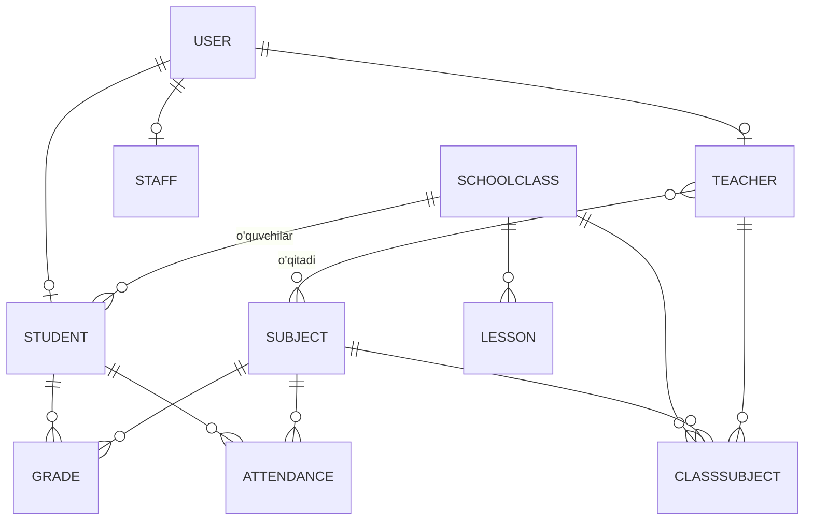

# 34 — Backend: Entity modellar (JPA)

Ma'lumotlar bazasi modellari JPA `@Entity` sifatida. Munosabatlar (relationships), enumlar va bazaviy klass.

---

## 1. Bazaviy entity — `BaseEntity`

Umumiy maydonlar (id, yaratilgan/yangilangan vaqt):

```java
@MappedSuperclass
@Getter @Setter
@EntityListeners(AuditingEntityListener.class)
public abstract class BaseEntity {

    @Id
    @GeneratedValue(strategy = GenerationType.IDENTITY)
    private Long id;

    @CreatedDate
    @Column(updatable = false)
    private Instant createdAt;

    @LastModifiedDate
    private Instant updatedAt;
}
```

> `@EnableJpaAuditing` ni asosiy klassga qo'shing.

---

## 2. Enumlar

```java
public enum Role {
    ROLE_ADMIN, ROLE_DIRECTOR, ROLE_ZAVUCH, ROLE_TEACHER, ROLE_STUDENT
}

public enum Gender { ERKAK, AYOL }

public enum Quarter { FIRST, SECOND, THIRD, FOURTH }   // 1–4 chorak

public enum AttendanceStatus { SABABLI, SABABSIZ }     // Ha / Yo'q
```

---

## 3. `User` (autentifikatsiya uchun bazaviy)

Barcha foydalanuvchilar (har rol) shu jadval orqali tizimga kiradi:

```java
@Entity
@Table(name = "users",
       uniqueConstraints = @UniqueConstraint(columnNames = "login"))
@Getter @Setter
public class User extends BaseEntity {

    @Column(nullable = false, unique = true)
    private String login;

    @Column(nullable = false)
    private String passwordHash;          // bcrypt — HECH QACHON ochiq emas

    @Enumerated(EnumType.STRING)
    @Column(nullable = false)
    private Role role;

    private String firstName;
    private String lastName;
    private String middleName;

    private String photoUrl;
    private boolean active = true;

    @Transient
    public String getFullName() {
        return String.join(" ", lastName, firstName,
               middleName == null ? "" : middleName).trim();
    }
}
```

---

## 4. `Student` (O'quvchi)

```java
@Entity
@Table(name = "students")
@Getter @Setter
public class Student extends BaseEntity {

    @OneToOne(fetch = FetchType.LAZY, cascade = CascadeType.ALL)
    @JoinColumn(name = "user_id")
    private User user;                    // login/parol/rol shu yerda

    private String firstName;
    private String lastName;
    private String middleName;

    private LocalDate birthDate;

    @Enumerated(EnumType.STRING)
    private Gender gender;

    private String nationality;           // Millat
    private String country;               // Davlat
    private String region;                // Viloyat
    private String district;              // Tuman
    private String address;               // Uy manzili

    private String phone;
    private String parentPhone;           // Ota-onaning telefoni

    @ManyToOne(fetch = FetchType.LAZY)
    @JoinColumn(name = "class_id")
    private SchoolClass schoolClass;      // sinf + guruh
}
```

---

## 5. `Teacher` (O'qituvchi)

```java
@Entity
@Table(name = "teachers")
@Getter @Setter
public class Teacher extends BaseEntity {

    @OneToOne(fetch = FetchType.LAZY, cascade = CascadeType.ALL)
    @JoinColumn(name = "user_id")
    private User user;

    private String firstName;
    private String lastName;
    private String middleName;
    private LocalDate birthDate;

    @Enumerated(EnumType.STRING)
    private Gender gender;

    private String phone;
    private String address;

    @ManyToMany
    @JoinTable(name = "teacher_subjects",
        joinColumns = @JoinColumn(name = "teacher_id"),
        inverseJoinColumns = @JoinColumn(name = "subject_id"))
    private Set<Subject> subjects = new HashSet<>();   // o'qitadigan fanlar
}
```

---

## 6. `Staff` (Xodim — texnik)

```java
@Entity
@Table(name = "staff")
@Getter @Setter
public class Staff extends BaseEntity {

    @OneToOne(fetch = FetchType.LAZY, cascade = CascadeType.ALL)
    @JoinColumn(name = "user_id")
    private User user;

    private String firstName;
    private String lastName;
    private String middleName;
    private LocalDate birthDate;
    private String phone;

    private String position;              // Kasbi: Elektrchi, Qorovul, Tozalovchi
}
```

---

## 7. `SchoolClass` (Sinf)

```java
@Entity
@Table(name = "classes",
       uniqueConstraints = @UniqueConstraint(columnNames = {"grade", "group_name"}))
@Getter @Setter
public class SchoolClass extends BaseEntity {

    @Column(nullable = false)
    private Integer grade;                // 1–11

    @Column(name = "group_name", nullable = false)
    private String groupName;             // A, B, V

    @ManyToOne(fetch = FetchType.LAZY)
    @JoinColumn(name = "homeroom_teacher_id")
    private Teacher homeroomTeacher;      // sinf rahbari (ixtiyoriy)

    @OneToMany(mappedBy = "schoolClass")
    private List<Student> students = new ArrayList<>();

    @Transient
    public String getName() { return grade + "-" + groupName; }  // "9-B"

    @Transient
    public int getStudentCount() { return students.size(); }
}
```

---

## 8. `Subject` (Fan)

```java
@Entity
@Table(name = "subjects",
       uniqueConstraints = @UniqueConstraint(columnNames = "name"))
@Getter @Setter
public class Subject extends BaseEntity {

    @Column(nullable = false, unique = true)
    private String name;                  // Matematika, Ingliz tili...

    private String code;                  // ixtiyoriy: MAT, ING
}
```

---

## 9. `ClassSubject` (Sinf-Fan-O'qituvchi bog'lanishi)

Sinfga qaysi fanni qaysi o'qituvchi o'tishini bog'laydi:

```java
@Entity
@Table(name = "class_subjects",
       uniqueConstraints = @UniqueConstraint(columnNames = {"class_id", "subject_id"}))
@Getter @Setter
public class ClassSubject extends BaseEntity {

    @ManyToOne(fetch = FetchType.LAZY) @JoinColumn(name = "class_id")
    private SchoolClass schoolClass;

    @ManyToOne(fetch = FetchType.LAZY) @JoinColumn(name = "subject_id")
    private Subject subject;

    @ManyToOne(fetch = FetchType.LAZY) @JoinColumn(name = "teacher_id")
    private Teacher teacher;
}
```

---

## 10. `Lesson` (Dars jadvali yozuvi)

```java
@Entity
@Table(name = "lessons")
@Getter @Setter
public class Lesson extends BaseEntity {

    @ManyToOne(fetch = FetchType.LAZY) @JoinColumn(name = "class_id")
    private SchoolClass schoolClass;

    @ManyToOne(fetch = FetchType.LAZY) @JoinColumn(name = "subject_id")
    private Subject subject;

    @ManyToOne(fetch = FetchType.LAZY) @JoinColumn(name = "teacher_id")
    private Teacher teacher;

    @Enumerated(EnumType.STRING)
    private Quarter quarter;              // chorak

    private DayOfWeek dayOfWeek;          // MONDAY..SATURDAY
    private LocalTime startTime;          // 08:00
    private Integer durationMinutes;      // 45
    private String room;                  // kabinet (ixtiyoriy)
}
```

---

## 11. `Grade` (Baho)

```java
@Entity
@Table(name = "grades")
@Getter @Setter
public class Grade extends BaseEntity {

    @ManyToOne(fetch = FetchType.LAZY) @JoinColumn(name = "student_id")
    private Student student;

    @ManyToOne(fetch = FetchType.LAZY) @JoinColumn(name = "subject_id")
    private Subject subject;

    @ManyToOne(fetch = FetchType.LAZY) @JoinColumn(name = "teacher_id")
    private Teacher teacher;

    @Min(2) @Max(5)
    private Integer value;                // 2–5

    @Enumerated(EnumType.STRING)
    private Quarter quarter;

    private LocalDateTime gradedAt;       // dars sanasi/vaqti
}
```

---

## 12. `Attendance` (Davomat)

```java
@Entity
@Table(name = "attendance")
@Getter @Setter
public class Attendance extends BaseEntity {

    @ManyToOne(fetch = FetchType.LAZY) @JoinColumn(name = "student_id")
    private Student student;

    @ManyToOne(fetch = FetchType.LAZY) @JoinColumn(name = "subject_id")
    private Subject subject;

    @ManyToOne(fetch = FetchType.LAZY) @JoinColumn(name = "teacher_id")
    private Teacher teacher;

    @Enumerated(EnumType.STRING)
    private Quarter quarter;

    private LocalDateTime lessonDateTime; // dars sanasi + vaqti
    private Integer durationMinutes;      // 45

    @Enumerated(EnumType.STRING)
    private AttendanceStatus status;      // SABABLI / SABABSIZ
    private String note;                  // sabab izohi (ixtiyoriy)
}
```

---

## 13. Munosabatlar diagrammasi (qisqa)



To'liq ER model va DDL → [37-PostgreSQL-model.md](37-PostgreSQL-model.md)

---

⬅️ [33 — Arxitektura](33-Backend-arxitektura.md) · ➡️ [35 — REST API](35-Backend-rest-api.md)
