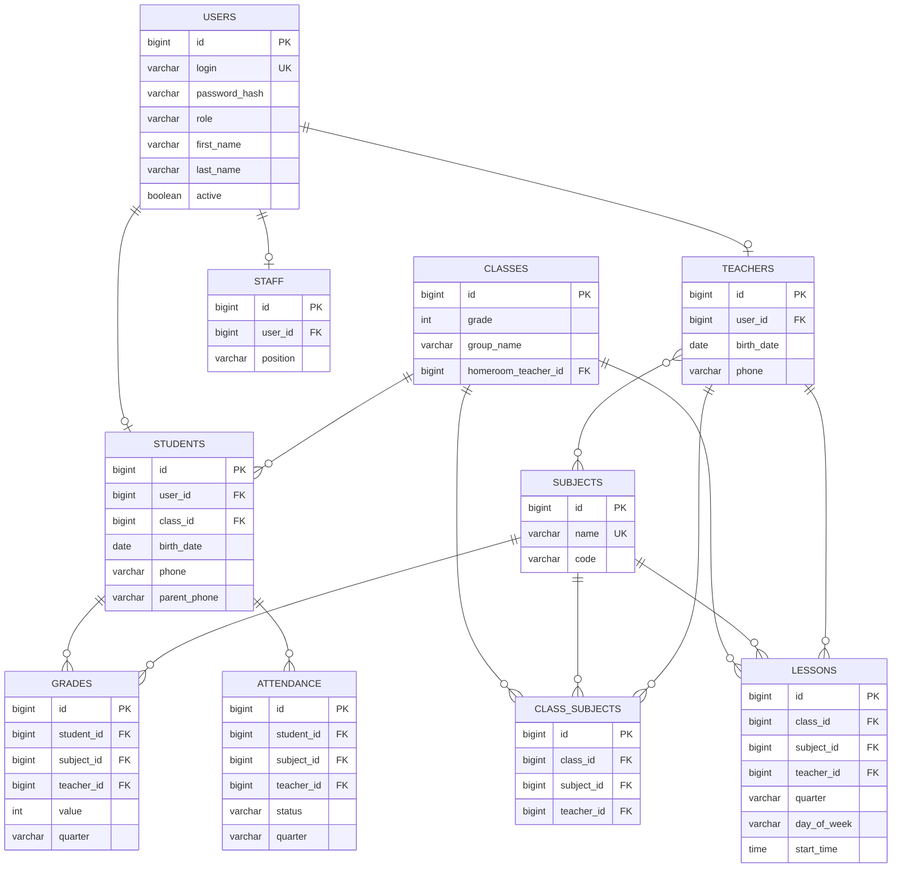

# 37 — PostgreSQL ma'lumotlar bazasi modeli

To'liq DDL (CREATE TABLE), munosabatlar, indekslar va ER diagramma. Flyway migratsiyasi sifatida ishlatish mumkin.

---

## 1. ER diagramma



---

## 2. DDL — Enum turlari

PostgreSQL'da enumlar yoki `VARCHAR + CHECK` ishlatish mumkin. Bu yerda `VARCHAR + CHECK` (moslashuvchanroq):

```sql
-- Rollar, jins, chorak, davomat — CHECK orqali cheklanadi (quyida jadvallarda)
```

---

## 3. DDL — Jadvallar

```sql
-- =========================================================
-- USERS — barcha foydalanuvchilar (autentifikatsiya)
-- =========================================================
CREATE TABLE users (
    id            BIGINT GENERATED BY DEFAULT AS IDENTITY PRIMARY KEY,
    login         VARCHAR(50)  NOT NULL UNIQUE,
    password_hash VARCHAR(255) NOT NULL,                 -- bcrypt
    role          VARCHAR(20)  NOT NULL
                  CHECK (role IN ('ROLE_ADMIN','ROLE_DIRECTOR','ROLE_ZAVUCH','ROLE_TEACHER','ROLE_STUDENT')),
    first_name    VARCHAR(60),
    last_name     VARCHAR(60),
    middle_name   VARCHAR(60),
    photo_url     VARCHAR(255),
    active        BOOLEAN      NOT NULL DEFAULT TRUE,
    created_at    TIMESTAMP    NOT NULL DEFAULT now(),
    updated_at    TIMESTAMP
);

-- =========================================================
-- SUBJECTS — fanlar
-- =========================================================
CREATE TABLE subjects (
    id         BIGINT GENERATED BY DEFAULT AS IDENTITY PRIMARY KEY,
    name       VARCHAR(80) NOT NULL UNIQUE,
    code       VARCHAR(10),
    created_at TIMESTAMP NOT NULL DEFAULT now(),
    updated_at TIMESTAMP
);

-- =========================================================
-- TEACHERS — o'qituvchilar
-- =========================================================
CREATE TABLE teachers (
    id          BIGINT GENERATED BY DEFAULT AS IDENTITY PRIMARY KEY,
    user_id     BIGINT UNIQUE REFERENCES users(id) ON DELETE CASCADE,
    first_name  VARCHAR(60),
    last_name   VARCHAR(60),
    middle_name VARCHAR(60),
    birth_date  DATE,
    gender      VARCHAR(10) CHECK (gender IN ('ERKAK','AYOL')),
    phone       VARCHAR(20),
    address     VARCHAR(255),
    created_at  TIMESTAMP NOT NULL DEFAULT now(),
    updated_at  TIMESTAMP
);

-- O'qituvchi ↔ Fan (ko'pga-ko'p)
CREATE TABLE teacher_subjects (
    teacher_id BIGINT NOT NULL REFERENCES teachers(id) ON DELETE CASCADE,
    subject_id BIGINT NOT NULL REFERENCES subjects(id) ON DELETE CASCADE,
    PRIMARY KEY (teacher_id, subject_id)
);

-- =========================================================
-- CLASSES — sinflar (grade + group noyob)
-- =========================================================
CREATE TABLE classes (
    id                  BIGINT GENERATED BY DEFAULT AS IDENTITY PRIMARY KEY,
    grade               INT NOT NULL CHECK (grade BETWEEN 1 AND 11),
    group_name          VARCHAR(5) NOT NULL,
    homeroom_teacher_id BIGINT REFERENCES teachers(id) ON DELETE SET NULL,
    created_at          TIMESTAMP NOT NULL DEFAULT now(),
    updated_at          TIMESTAMP,
    UNIQUE (grade, group_name)
);

-- =========================================================
-- STUDENTS — o'quvchilar
-- =========================================================
CREATE TABLE students (
    id           BIGINT GENERATED BY DEFAULT AS IDENTITY PRIMARY KEY,
    user_id      BIGINT UNIQUE REFERENCES users(id) ON DELETE CASCADE,
    class_id     BIGINT REFERENCES classes(id) ON DELETE SET NULL,
    first_name   VARCHAR(60),
    last_name    VARCHAR(60),
    middle_name  VARCHAR(60),
    birth_date   DATE,
    gender       VARCHAR(10) CHECK (gender IN ('ERKAK','AYOL')),
    nationality  VARCHAR(40),
    country      VARCHAR(40),
    region       VARCHAR(60),
    district     VARCHAR(60),
    address      VARCHAR(255),
    phone        VARCHAR(20),
    parent_phone VARCHAR(20),
    created_at   TIMESTAMP NOT NULL DEFAULT now(),
    updated_at   TIMESTAMP
);

-- =========================================================
-- STAFF — texnik xodimlar
-- =========================================================
CREATE TABLE staff (
    id          BIGINT GENERATED BY DEFAULT AS IDENTITY PRIMARY KEY,
    user_id     BIGINT UNIQUE REFERENCES users(id) ON DELETE CASCADE,
    first_name  VARCHAR(60),
    last_name   VARCHAR(60),
    middle_name VARCHAR(60),
    birth_date  DATE,
    phone       VARCHAR(20),
    position    VARCHAR(60),                              -- Elektrchi, Qorovul...
    created_at  TIMESTAMP NOT NULL DEFAULT now(),
    updated_at  TIMESTAMP
);

-- =========================================================
-- CLASS_SUBJECTS — sinf-fan-o'qituvchi bog'lanishi
-- =========================================================
CREATE TABLE class_subjects (
    id         BIGINT GENERATED BY DEFAULT AS IDENTITY PRIMARY KEY,
    class_id   BIGINT NOT NULL REFERENCES classes(id) ON DELETE CASCADE,
    subject_id BIGINT NOT NULL REFERENCES subjects(id) ON DELETE CASCADE,
    teacher_id BIGINT REFERENCES teachers(id) ON DELETE SET NULL,
    created_at TIMESTAMP NOT NULL DEFAULT now(),
    updated_at TIMESTAMP,
    UNIQUE (class_id, subject_id)
);

-- =========================================================
-- LESSONS — dars jadvali
-- =========================================================
CREATE TABLE lessons (
    id               BIGINT GENERATED BY DEFAULT AS IDENTITY PRIMARY KEY,
    class_id         BIGINT NOT NULL REFERENCES classes(id) ON DELETE CASCADE,
    subject_id       BIGINT NOT NULL REFERENCES subjects(id),
    teacher_id       BIGINT REFERENCES teachers(id) ON DELETE SET NULL,
    quarter          VARCHAR(10) CHECK (quarter IN ('FIRST','SECOND','THIRD','FOURTH')),
    day_of_week      VARCHAR(10),                         -- MONDAY..SATURDAY
    start_time       TIME,
    duration_minutes INT DEFAULT 45,
    room             VARCHAR(20),
    created_at       TIMESTAMP NOT NULL DEFAULT now(),
    updated_at       TIMESTAMP
);

-- =========================================================
-- GRADES — baholar
-- =========================================================
CREATE TABLE grades (
    id         BIGINT GENERATED BY DEFAULT AS IDENTITY PRIMARY KEY,
    student_id BIGINT NOT NULL REFERENCES students(id) ON DELETE CASCADE,
    subject_id BIGINT NOT NULL REFERENCES subjects(id),
    teacher_id BIGINT REFERENCES teachers(id) ON DELETE SET NULL,
    value      INT NOT NULL CHECK (value BETWEEN 2 AND 5),
    quarter    VARCHAR(10) CHECK (quarter IN ('FIRST','SECOND','THIRD','FOURTH')),
    graded_at  TIMESTAMP,
    created_at TIMESTAMP NOT NULL DEFAULT now(),
    updated_at TIMESTAMP
);

-- =========================================================
-- ATTENDANCE — davomat
-- =========================================================
CREATE TABLE attendance (
    id               BIGINT GENERATED BY DEFAULT AS IDENTITY PRIMARY KEY,
    student_id       BIGINT NOT NULL REFERENCES students(id) ON DELETE CASCADE,
    subject_id       BIGINT NOT NULL REFERENCES subjects(id),
    teacher_id       BIGINT REFERENCES teachers(id) ON DELETE SET NULL,
    quarter          VARCHAR(10) CHECK (quarter IN ('FIRST','SECOND','THIRD','FOURTH')),
    lesson_date_time TIMESTAMP,
    duration_minutes INT DEFAULT 45,
    status           VARCHAR(10) CHECK (status IN ('SABABLI','SABABSIZ')),
    note             VARCHAR(255),
    created_at       TIMESTAMP NOT NULL DEFAULT now(),
    updated_at       TIMESTAMP
);
```

---

## 4. Indekslar (unumdorlik uchun)

```sql
-- Qidiruv va filtrlar tez-tez ishlatiladi
CREATE INDEX idx_students_class      ON students(class_id);
CREATE INDEX idx_students_name       ON students(last_name, first_name);
CREATE INDEX idx_teachers_name       ON teachers(last_name, first_name);
CREATE INDEX idx_staff_position      ON staff(position);
CREATE INDEX idx_lessons_class_q     ON lessons(class_id, quarter);
CREATE INDEX idx_grades_student_q    ON grades(student_id, quarter);
CREATE INDEX idx_attendance_student  ON attendance(student_id, quarter);
CREATE INDEX idx_class_subjects_cls  ON class_subjects(class_id);
```

---

## 5. Namuna ma'lumot (seed)

```sql
-- Admin foydalanuvchi (parol: 'admin123' — bcrypt hash bilan almashtiriladi)
INSERT INTO users (login, password_hash, role, first_name, last_name)
VALUES ('admin', '$2a$12$REPLACE_WITH_REAL_BCRYPT_HASH', 'ROLE_ADMIN', 'Saidakbar', 'Mahkamov');

-- Fanlar
INSERT INTO subjects (name) VALUES
  ('Matematika'), ('Ona tili'), ('Ingliz tili'), ('Fizika'),
  ('Kimyo'), ('Biologiya'), ('Tarix'), ('Geometriya'), ('Algebra');

-- Sinf
INSERT INTO classes (grade, group_name) VALUES (9, 'A'), (9, 'B'), (1, 'A');
```

---

## 6. Ma'lumotlar yaxlitligi (constraints xulosa)

| Qoida | Mexanizm |
|-------|----------|
| Login noyob | `UNIQUE (login)` |
| Sinf+guruh noyob | `UNIQUE (grade, group_name)` |
| Fan nomi noyob | `UNIQUE (name)` |
| Baho 2–5 | `CHECK (value BETWEEN 2 AND 5)` |
| Rol cheklangan | `CHECK (role IN (...))` |
| User o'chsa — profil ham | `ON DELETE CASCADE` |
| O'qituvchi o'chsa — dars saqlanadi | `ON DELETE SET NULL` |

---

⬅️ [36 — Security & JWT](36-Backend-security-jwt.md) · ➡️ [38 — SEO](38-SEO.md)
